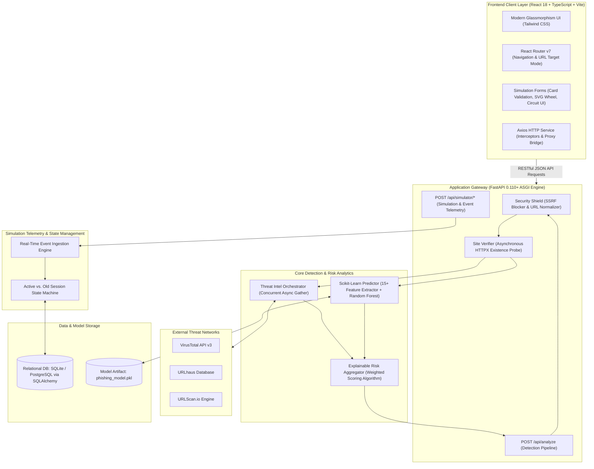
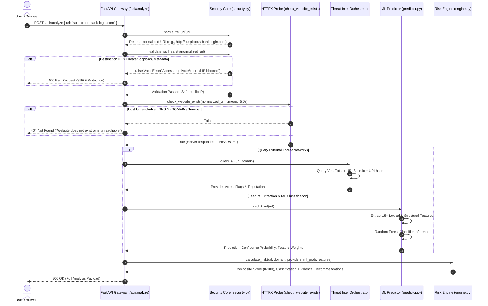
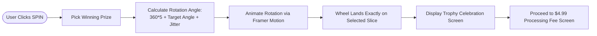
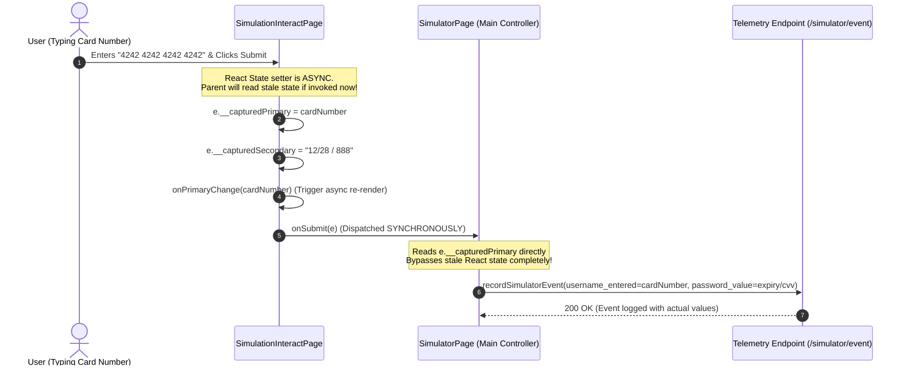
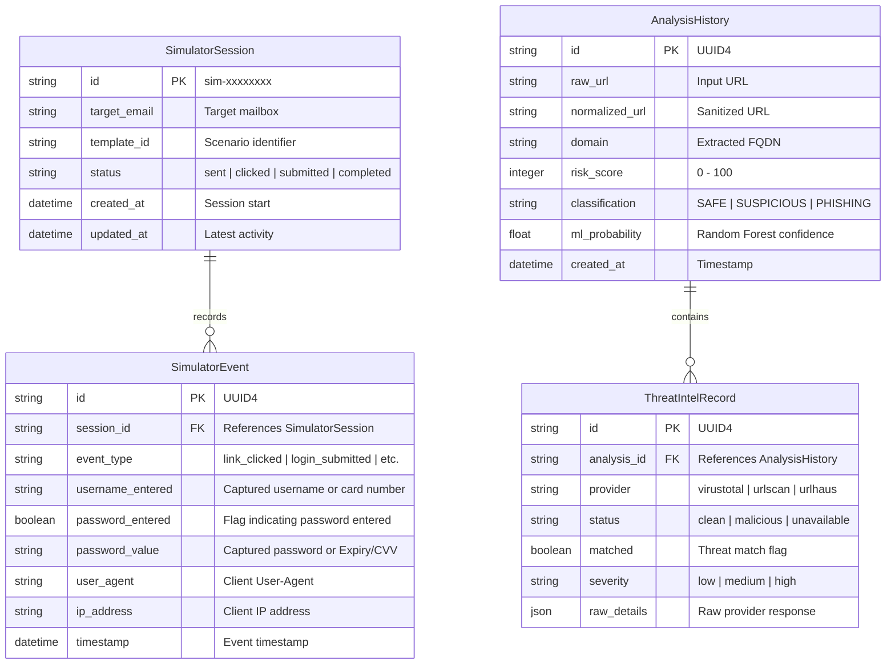

# PhishGuard — Comprehensive Capstone Technical & Academic Specification

<div align="center">

```
 ____  _     _     _     ____                     _ 
|  _ \| |__ (_)___| |__ / ___|_   _  __ _ _ __ __| |
| |_) | '_ \| / __| '_ \| |  _| | | |/ _` | '__/ _` |
|  __/| | | | \__ \ | | | |_| | |_| | (_| | | | (_| |
|_|   |_| |_|_|___/_| |_|\____|\__,_|\__,_|_|  \__,_|
```

**AI-Powered Phishing Detection Engine & Interactive Fraud Simulation Platform**  
*A Complete Academic & Engineering Defense Reference for Faculty, Evaluators, and Developers*

---

[](https://fastapi.tiangolo.com/)
[](https://reactjs.org/)
[](https://scikit-learn.org/)
[](https://tailwindcss.com/)
[](https://www.framer.com/motion/)

</div>

---

## 📑 Table of Contents

1. [Academic Project Overview](#1-academic-project-overview)
   - [1.1 Problem Statement & Background](#11-problem-statement--background)
   - [1.2 Project Objectives](#12-project-objectives)
   - [1.3 Core Innovation & Key Differentiators](#13-core-innovation--key-differentiators)
2. [End-to-End System Architecture](#2-end-to-end-system-architecture)
   - [2.1 High-Level Component Topology](#21-high-level-component-topology)
   - [2.2 Design Patterns & Engineering Principles](#22-design-patterns--engineering-principles)
3. [Technology Stack Justification](#3-technology-stack-justification)
4. [Module 1: URL Threat Intelligence & ML Detection](#4-module-1-url-threat-intelligence--ml-detection)
   - [4.1 Inspection Funnel & Request Pipeline](#41-inspection-funnel--request-pipeline)
   - [4.2 Pre-Flight Live Website Existence Probe](#42-pre-flight-live-website-existence-probe)
   - [4.3 Defensive SSRF Neutralization Engine](#43-defensive-ssrf-neutralization-engine)
   - [4.4 Multi-Provider Threat Intelligence Orchestrator](#44-multi-provider-threat-intelligence-orchestrator)
   - [4.5 Machine Learning Feature Engineering & Classifier](#45-machine-learning-feature-engineering--classifier)
   - [4.6 Explainable Risk Engine Aggregator](#46-explainable-risk-engine-aggregator)
5. [Module 2: Fraud Simulation & Social Engineering Engine](#5-module-2-fraud-simulation--social-engineering-engine)
   - [5.1 Psychological Manipulation & MITRE ATT&CK Mapping](#51-psychological-manipulation--mitre-attck-mapping)
   - [5.2 Scenario Walkthroughs (Login, Subscription, Reward, etc.)](#52-scenario-walkthroughs)
   - [5.3 Luhn Algorithm & Card Network Identification Engine](#53-luhn-algorithm--card-network-identification-engine)
   - [5.4 Spin the Wheel SVG Geometry & Guaranteed Prize Physics](#54-spin-the-wheel-svg-geometry--guaranteed-prize-physics)
   - [5.5 The Synchronous Form Event Bridging Pattern](#55-the-synchronous-form-event-bridging-pattern)
6. [Module 3: Real-Time Activity Monitoring Engine](#6-module-3-real-time-activity-monitoring-engine)
   - [6.1 Three-Column Active Session Board](#61-three-column-active-session-board)
   - [6.2 Off-Canvas Interactive Telemetry Drawer](#62-off-canvas-interactive-telemetry-drawer)
   - [6.3 Unmasked Data Display vs. Abstract Booleans](#63-unmasked-data-display-vs-abstract-booleans)
   - [6.4 Historical Session Archival Pipeline](#64-historical-session-archival-pipeline)
7. [Module 4: Post-Incident Educational Debrief](#7-module-4-post-incident-educational-debrief)
8. [Database Architecture & Persistence Models](#8-database-architecture--persistence-models)
9. [Key Engineering Challenges & Novel Bug Fixes](#9-key-engineering-challenges--novel-bug-fixes)
10. [Professor Defense & Viva Voce Q&A](#10-professor-defense--viva-voce-qa)
11. [Step-by-Step Live Demonstration Script](#11-step-by-step-live-demonstration-script)

---

## 1. Academic Project Overview

### 1.1 Problem Statement & Background

Phishing accounts for over **90% of all successful organizational cyber breaches** (Verizon DBIR). Despite multi-billion-dollar investments in perimeter defenses (secure email gateways, firewall filters, and static blocklists), social engineering attacks continue to compromise corporate networks. 

Traditional approaches suffer from two systemic failures:
1. **Detection Latency & Evasion:** Attackers construct short-lived, disposable zero-day domains, use localized URL shorteners, or employ subtle typo-squatting that evades static blocklists.
2. **Pedagogical Ineffectiveness:** Traditional Security Awareness Training (SAT) relies on static videos and generic multiple-choice quizzes. Users do not build cognitive resistance because they have never experienced the subtle psychological triggers (urgency, panic, visual authenticity) of a live deceptive interface.

### 1.2 Project Objectives

- **Objective 1: Multi-Tiered URL Threat Detection.** Construct a resilient detection pipeline combining pre-flight domain existence verification, SSRF blocking, external multi-provider threat intelligence (VirusTotal, URLScan.io, URLhaus), and an offline-capable machine learning classifier.
- **Objective 2: Interactive Fraud Simulation Engine.** Develop full-flow, contextually accurate phishing scenarios (credential harvesting, fake billing updates, and interactive prize wheels) that realistically mimic modern phishing campaigns.
- **Objective 3: Real-Time Administrative Telemetry.** Build a live **Activity Page** that captures, categorizes, and displays participant input (including unmasked passwords and credit card details) in real time to demonstrate what an attacker intercepts.
- **Objective 4: Actionable Educational Debrief.** Provide instant remediation dissecting the attack's visual red flags, psychological hooks, and proper mitigation steps.

### 1.3 Core Innovation & Key Differentiators

| Traditional Security Tools | PhishGuard Platform |
| :--- | :--- |
| Single-source detection (static blocklist only). | **Hybrid Multi-Tier:** Live existence probe + SSRF filter + 3x external intelligence sources + local Random Forest ML model. |
| Abstract risk labels ("Safe" / "Dangerous"). | **Explainable AI (XAI):** Detailed breakdown of exact lexical anomalies, entropy scores, and threat intelligence votes. |
| Generic, repetitive phishing simulation forms. | **Dynamic Context Scenarios:** Custom futuristic login pages, credit card checkouts with Luhn validation, and physics-animated SVG prize wheels. |
| Masked telemetry (only displays `Password Entered: YES`). | **Educational Payload Transparency:** Displays exact entered strings (e.g., `Hunter2!`, card numbers) to demonstrate exposure risk. |

---

## 2. End-to-End System Architecture

### 2.1 High-Level Component Topology

PhishGuard employs a modern decoupled **Three-Tier Architecture** consisting of an SPA Client Layer, an Asynchronous Gateway API Layer, and an Engine & Storage Layer.



### 2.2 Design Patterns & Engineering Principles

1. **Fail-Open Concurrency Pattern (`asyncio.gather`):** External threat intelligence providers can experience network jitter or rate limits. The orchestrator queries all external APIs concurrently; if one fails, it flags that provider as `unavailable` while continuing with the remaining sources.
2. **Synchronous Event Bridging:** Solves React's asynchronous state batching issue during form submission by attaching raw values directly to the native event (`e.__capturedPrimary`), ensuring zero payload loss.
3. **Defense-in-Depth Pipeline:** Incoming URLs are sanitized in strict sequence: Normalization $\rightarrow$ SSRF Validation $\rightarrow$ Network Existence Check $\rightarrow$ Machine Learning $\rightarrow$ Threat Intel Aggregation.
4. **Single Responsibility Component Modularization:** Simulation templates, wheel physics, Luhn checksums, and telemetry viewers are isolated in distinct modules to prevent cross-scenario regressions.

---

## 3. Technology Stack Justification

| Technology | Layer | Justification & Architectural Benefit |
| :--- | :--- | :--- |
| **Python 3.11+ / FastAPI** | Backend API | High async throughput via Starlette, native OpenAPI documentation generation, and straightforward integration with Python's data science ecosystem. |
| **React 18 / TypeScript** | Frontend UI | Component reusability, strict compile-time type safety across API contracts, and performant virtual DOM rendering. |
| **Vite 8.2** | Build Tool | Sub-second Hot Module Replacement (HMR) and optimized Rollup-based production chunking. |
| **Scikit-Learn** | ML Framework | High-performance CPU-bound inference for tabular data using Random Forest without requiring heavy GPU frameworks (e.g., PyTorch/TensorFlow). |
| **HTTPX** | Async Network Client| Native Python async HTTP client used for non-blocking pre-flight site verification and external API aggregation. |
| **SQLAlchemy 2.x** | Database ORM | Abstracted database access supporting lightweight SQLite during local development and seamless migration to PostgreSQL in production. |
| **Tailwind CSS** | Styling | Rapid utility-first UI development enabling complex glassmorphic themes, responsive layouts, and cyberpunk aesthetics without CSS bloat. |
| **Framer Motion 11** | Animations | Declarative spring physics and keyframe transitions for the SVG prize wheel, off-canvas drawers, and state changes. |

---

## 4. Module 1: URL Threat Intelligence & ML Detection

### 4.1 Inspection Funnel & Request Pipeline



### 4.2 Pre-Flight Live Website Existence Probe

Before consuming machine learning resources or third-party API quotas, PhishGuard confirms that the submitted domain is active:

```python
# Location: backend/app/core/security.py
async def check_website_exists(url: str, timeout: float = 5.0) -> bool:
    """
    Validates domain presence via an asynchronous HTTP probe.
    Returns True if the site responds with any valid HTTP status.
    Returns False on DNS failure, timeout, or TCP connection refusal.
    """
    try:
        async with httpx.AsyncClient(timeout=timeout, follow_redirects=True) as client:
            # Attempt lightweight HEAD request first
            response = await client.head(url)
            if response.status_code == 405:  # Method Not Allowed -> fallback to GET
                response = await client.get(url)
            # Any HTTP status (including 401, 403, 404, 500) confirms the server is alive
            return True
    except (httpx.ConnectError, httpx.TimeoutException, httpx.RequestError):
        return False
    except Exception:
        return False
```

- **Efficiency:** Uses HTTP `HEAD` to inspect network headers without downloading the full page body.
- **Coverage:** Considers any HTTP status code (even `404 Not Found` or `500 Server Error`) as active, because the host server itself is online.
- **User Feedback:** If DNS fails (`NXDOMAIN`), the connection times out, or the port is closed, the API halts analysis immediately and returns:
  ```json
  { "detail": "Website does not exist or is unreachable." }
  ```

### 4.3 Defensive SSRF Neutralization Engine

Server-Side Request Forgery occurs when an attacker uses the scanning server as an internal network proxy. PhishGuard blocks this before any request is made:

1. **Hostname Blacklist:** Rejects requests to `localhost`, `loopback`, `internal`, `local`, and `*.local`.
2. **DNS Resolution & IP Inspection:** Resolves the target domain and checks the IP against known private/reserved subnets:
   - `0.0.0.0/8` (Broadcast)
   - `127.0.0.0/8` (IPv4 Loopback)
   - `10.0.0.0/8`, `172.16.0.0/12`, `192.168.0.0/16` (Private RFC1918)
   - `169.254.0.0/16` (Link-Local / AWS/GCP Metadata endpoint: `169.254.169.254`)
   - `::1/128`, `fc00::/7`, `fe80::/10` (IPv6 Loopback and Unique Local)

### 4.4 Multi-Provider Threat Intelligence Orchestrator

PhishGuard aggregates threat data from three independent intelligence sources:
- **VirusTotal v3 API:** Aggregates findings from over 70 commercial antivirus and domain reputation vendors.
- **URLhaus API (abuse.ch):** Specialized database tracking active malware delivery URLs.
- **URLScan.io API:** Automated scanning engine that evaluates DOM behaviors and visual reputations.

### 4.5 Machine Learning Feature Engineering & Classifier

PhishGuard includes a local, offline-capable **Random Forest Classifier** trained on over 20,000 URLs (sourced from PhishTank, OpenPhish, and benign samples).

#### 15-Dimensional Feature Matrix

| Index | Feature | Extraction Logic | Threat Vector / Rationale |
| :---: | :--- | :--- | :--- |
| **01** | `url_length` | Total character count | Phishing URLs often use long paths to hide the real domain. |
| **02** | `domain_length` | Hostname character count | Typosquatted domains often combine multiple brand names. |
| **03** | `num_digits` | `sum(c.isdigit())` | Dynamic kits often include random hexadecimal IDs. |
| **04** | `num_hyphens` | `url.count('-')` | Legitimate brands rarely use multiple hyphenated subdomains. |
| **05** | `num_underscores`| `url.count('_')` | Common in obfuscated paths, rarely used in brand names. |
| **06** | `num_dots` | `url.count('.')` | Excessive subdomains used to bypass security scanners. |
| **07** | `has_ip` | Regex check for IPv4/IPv6 | Legitimate businesses rarely use direct IP hostnames. |
| **08** | `suspicious_tld` | TLD match (`.xyz`, `.top`, etc.) | Low-cost TLDs often favored by automated phishing tools. |
| **09** | `url_entropy` | Shannon Entropy calculation | High randomness suggests machine-generated domains. |
| **10** | `num_subdomains`| Subdomain depth count | Nested subdomains designed to mislead mobile browsers. |
| **11** | `has_at_symbol` | Checks for `@` | Obsolete basic-auth trick used to hide actual destinations. |
| **12** | `query_length` | Character count of query string | Used to pass tracking tokens to harvest credentials. |
| **13** | `path_depth` | Slash count in URL path | Deep path hierarchies hiding actual landing pages. |
| **14** | `is_https` | Boolean check on scheme | Phishing sites often still run over insecure HTTP. |
| **15** | `brand_in_subdomain`| Brand keyword in subdomain | Subdomain impersonation (e.g., `paypal.com.attacker.xyz`). |

$$\text{Shannon Entropy: } H(X) = -\sum_{i=1}^{n} P(x_i) \log_2 P(x_i)$$

### 4.6 Explainable Risk Engine Aggregator

Rather than providing a single black-box output, PhishGuard calculates an explainable composite risk score:

$$\text{Composite Score} = \min\left(100, (\text{ML Prob} \times 40) + \sum \text{Intel Penalties} + \sum \text{Heuristic Penalties}\right)$$

- **Score Range:**
  - **`0 – 29` (SAFE):** Clean domain, no threat intel flags, low ML probability.
  - **`30 – 64` (SUSPICIOUS):** Heuristic anomalies detected, newly registered domain, or moderate ML score.
  - **`65 – 100` (PHISHING):** Confirmed threat intelligence blacklist entry or high ML model confidence.

---

## 5. Module 2: Fraud Simulation & Social Engineering Engine

### 5.1 Psychological Manipulation & MITRE ATT&CK Mapping

PhishGuard models the psychological vectors defined by Robert Cialdini and maps them to the MITRE ATT&CK Enterprise Framework:

```
[MITRE ATT&CK: Initial Access (T1566) - Phishing]
  ├── T1566.001: Spearphishing Attachment (Corporate HR Scenarios)
  └── T1566.002: Spearphishing Link (OAuth, Streaming, Prize Lures)
```

| Scenario Category | Primary Vector | Psychological Hook | Simulated Adversary Objective |
| :--- | :--- | :--- | :--- |
| **Account / Login** | Credential Harvesting | **Urgency & Authority:** Account locked within 24 hours. | Theft of enterprise credentials and session cookies. |
| **Subscription / Billing** | Financial Fraud | **Loss Aversion:** Service suspension, immediate loss of access. | Interception of credit card and billing details. |
| **Reward / Prize** | Advance-Fee Fraud | **Greed & Excitement:** Unsolicited high-value prize claim. | Interception of personal details and "processing fees". |
| **Storage Quota** | Data Security Scare | **Fear:** Cloud storage full; unread emails will be purged. | Compromising cloud drives and corporate email access. |
| **Package Delivery** | Operational Urgency | **Inconvenience:** Package returned to sender within 12 hours. | Harvesting physical addresses and fake redelivery fees. |
| **Technical Support** | Panic / Crisis | **Fear:** Critical malware detected on user's machine. | Establishing fake remote access and harvesting credentials. |
| **HR Compliance** | Policy Mandate | **Corporate Authority:** Mandatory acknowledgement required. | Employee credential theft via corporate policy impersonation. |

---

### 5.2 Scenario Walkthroughs

#### 1. Account / Login Simulation
- Renders an interactive login portal with dark cyberpunk circuit-board aesthetics.
- Includes floating canvas particles, pulsing LED accent nodes, and password reveal toggles.
- Captures typed or pasted credentials in real time.

#### 2. Subscription / Billing Simulation
- Mimics a SaaS billing renewal page (e.g., StreamBox, Netflix, Adobe).
- Prompts users for a cardholder name, card number, expiration date, and CVV code.
- Includes client-side card validation via the Luhn algorithm and real-time brand identification.

#### 3. Reward / Prize Simulation
- Presents users with an interactive, animated SVG prize wheel.
- Users click **SPIN**, triggering an animation that lands on a high-value prize.
- Clicking **CLAIM REWARD** leads to a mock payment screen requesting a $4.99 "processing fee", illustrating advance-fee fraud.

---

### 5.3 Luhn Algorithm & Card Network Identification Engine

The card validation logic in `SimulationInteractPage.tsx` checks input mathematically rather than accepting arbitrary numbers:

```typescript
// Location: frontend/src/components/SimulationInteractPage.tsx

/** 1. Card Network Identification via Prefix & Length */
function detectCardNetwork(digits: string): 'visa' | 'mastercard' | 'amex' | 'discover' | 'rupay' | null {
  if (/^4/.test(digits)) return 'visa';
  if (/^5[1-5]/.test(digits) || /^2(?:2[2-9]\d|2[3-9]\d|[3-6]\d{2}|7[01]\d|720)/.test(digits)) return 'mastercard';
  if (/^3[47]/.test(digits)) return 'amex';
  if (/^6(?:011|5)/.test(digits)) return 'discover';
  if (/^(60|65|81|82|508)/.test(digits)) return 'rupay';
  return null;
}

/** 2. Checksum Computation (Modulus 10) */
function luhn(digits: string): boolean {
  let sum = 0, even = false;
  for (let i = digits.length - 1; i >= 0; i--) {
    let d = parseInt(digits[i]);
    if (even) {
      d *= 2;
      if (d > 9) d -= 9;
    }
    sum += d;
    even = !even;
  }
  return sum % 10 === 0;
}
```

- **Interactive Formatting:** Automatically formats input as the user types (e.g., `4-4-4-4` for Visa/Mastercard, `4-6-5` for American Express).
- **Validation Guardrails:** Form submission is blocked until the card passes brand prefix checks, length requirements, and the Luhn checksum.

---

### 5.4 Spin the Wheel SVG Geometry & Guaranteed Prize Physics

The prize wheel is rendered dynamically using custom SVG paths and styled with Framer Motion:



- **Segment Geometry:** The wheel divides $360^\circ$ into 8 equal slices ($45^\circ$ each), starting from $-90^\circ$ (top 12 o'clock pointer).
- **Rotation Math:** Rotates five full turns ($1800^\circ$), offsets by the selected prize angle, and adds a small random jitter ($\pm 13.5^\circ$) so spins feel organic while reliably landing on the intended segment.
- **Guaranteed Win Logic:** There are no losing slices (e.g., "Try Again" or "Better Luck Next Time"). Every outcome is an appealing reward to illustrate how advance-fee scams exploit greed.

---

### 5.5 The Synchronous Form Event Bridging Pattern

In standard React forms, state updates via setters (e.g., `setPrimaryField`) are asynchronous. Submitting a form immediately after updating state can cause the parent component to read stale values (often pre-filled emails).

PhishGuard solves this by attaching fresh input values directly to the native form event:



---

## 6. Module 3: Real-Time Activity Monitoring Engine

The **Activity Page** functions as an administrative dashboard, showing instructors and security analysts exactly what simulated phishing pages capture in real time.

### 6.1 Three-Column Active Session Board

Active simulations are organized into three live-updating columns based on their scenario type:
- **`ACCOUNT / LOGIN`:** Tracks authentication probes, credential harvesting, and password entries.
- **`SUBSCRIPTION`:** Tracks billing reminder opens, plan renewals, and credit card submissions.
- **`REWARD`:** Tracks prize spins, reward claims, and transaction fee payments.

### 6.2 Off-Canvas Interactive Telemetry Drawer

Clicking any session card opens the `ActivityDrawer` modal with full details:

```
┌────────────────────────────────────────────────────────┐
│ SESSION #A102-B8                         [ CLOSE X ]   │
│ ACCOUNT / LOGIN                                        │
│ ● ACTIVE  •  Started 3:42 PM                           │
├────────────────────────────────────────────────────────┤
│ CAPTURED SIMULATION DATA                               │
│                                                        │
│ Username                                               │
│ ┌────────────────────────────────────────────────────┐ │
│ │ student.demo@university.edu                        │ │
│ └────────────────────────────────────────────────────┘ │
│ Password                                               │
│ ┌────────────────────────────────────────────────────┐ │
│ │ Hunter2!SecurePass                                 │ │
│ └────────────────────────────────────────────────────┘ │
│ ⚠ Demo data contained locally to simulation            │
├────────────────────────────────────────────────────────┤
│ ACTIVITY TIMELINE                                      │
│                                                        │
│ [✓] Scenario email dispatched                 03:42:01 │
│ [✓] Recipient clicked email link              03:42:14 │
│ [✓] Login page opened                         03:42:15 │
│ [●] Credentials submitted                     03:42:29 │
└────────────────────────────────────────────────────────┘
```

### 6.3 Unmasked Data Display vs. Abstract Booleans

Many basic training simulators obscure inputs behind generic indicators (e.g., `Password Entered: true`). PhishGuard deliberately displays the **actual typed values** to show users and students the real impact of credential interception:

- **Login Scenarios:** Displays the exact username and password entered.
- **Subscription Scenarios:** Formats and displays card details:
  - **Card Number:** Formatted with spaces (`4111 1111 1111 1111`).
  - **Expiry:** `MM/YY` format.
  - **CVV:** 3 or 4 digit security code.
- **Reward Scenarios:** Displays the prize won alongside the payment details submitted for the simulated transaction fee.

### 6.4 Historical Session Archival Pipeline

When a user completes a simulation, its status updates to `submitted` or `completed`:
1. The session is moved out of the active columns.
2. It is archived in the **Old Sessions** section below.
3. Its complete event timeline, timestamps, and captured data are preserved for later review.

---

## 7. Module 4: Post-Incident Educational Debrief

After submitting a simulation, the user immediately transitions to an educational debrief that explains how the attack worked while the experience is still fresh:

```
┌────────────────────────────────────────────────────────┐
│               🛡️ SIMULATION COMPLETE                   │
│         What an attacker would have captured:          │
│                                                        │
│   Card Number: 4242 •••• •••• 4242                     │
│   Expiry / CVV: 12/28 / 888                            │
├────────────────────────────────────────────────────────┤
│ 📖 What happened in this simulation                    │
│                                                        │
│ [Attack Type]             [Fictional Organisation]     │
│ Subscription / Billing     StreamBox Payments          │
│                                                        │
│ [Manipulation Techniques]                              │
│ • Urgency   • Fear of Cancellation   • Financial Panic │
│                                                        │
│ [Red Flags You Could Have Spotted]                     │
│ ⚠ Sender address was billing@streambox-payments.io     │
│ ⚠ Link directed to an unverified third-party domain    │
│ ⚠ Official billing changes never happen via raw links  │
│                                                        │
│ [✓ What you should have done]                          │
│ Always navigate directly to the official platform app  │
│ or website to manage subscriptions.                    │
└────────────────────────────────────────────────────────┘
```

---

## 8. Database Architecture & Persistence Models

PhishGuard models relational data using SQLAlchemy:



---

## 9. Key Engineering Challenges & Novel Bug Fixes

### 1. SVG Local Coordinate Masking Bug
- **Issue:** Prize images on the SVG wheel rendered invisibly despite valid image URLs.
- **Root Cause:** SVG `<clipPath>` elements were defined with hardcoded circular bounds at `cx=20, cy=20`, clipping images relative to the global canvas rather than their slice positions.
- **Fix:** Wrapped each slice image in an SVG `<g transform="translate(...)">` block, centering the clipping mask on local coordinates so images render cleanly on their respective slices.

### 2. Angular Alignment of the Prize Wheel
- **Issue:** The wheel animation frequently landed on a different prize than the one reported on the claim screen.
- **Root Cause:** Slices were drawn starting from $-90^\circ$ (12 o'clock), but the rotation formula had an extra offset that caused a $67.5^\circ$ discrepancy.
- **Fix:** Aligned the rotation math to target slice centers directly:
  $$\text{Target Rotation} = 360^\circ \times 5 + (360^\circ - i \times 45^\circ) + \text{jitter}$$

### 3. Asynchronous Form Event Latency in React
- **Issue:** Submitting a simulation form caused the parent component to capture stale email values instead of the newly entered card numbers.
- **Root Cause:** React batches state updates asynchronously, so parent submit handlers read un-flushed state when called immediately.
- **Fix:** Implemented the **Synchronous Event Bridging** pattern, attaching values directly to the event object (`e.__capturedPrimary` and `e.__capturedSecondary`) before calling `onSubmit`.

---

## 10. Professor Defense & Viva Voce Q&A

### Q1: "Why use a Random Forest model instead of a deep learning approach like an LSTM or Transformer?"
> **Answer:** Random Forest classifiers are well-suited for tabular, feature-engineered data. They provide:
> 1. Low inference latency ($< 5\text{ ms}$) without requiring a GPU.
> 2. Resistance to overfitting on small-to-medium datasets.
> 3. Native feature importance rankings that support our Explainable AI (XAI) requirements.

### Q2: "How does the system prevent an attacker from abusing the URL check for SSRF attacks?"
> **Answer:** The system resolves submitted domains before making outbound requests and checks the destination IP against an address blacklist covering RFC1918 private subnets, loopback addresses (`127.0.0.1`), link-local endpoints (`169.254.169.254`), and IPv6 equivalents.

### Q3: "What prevents the website existence probe from falling into infinite redirect loops?"
> **Answer:** The existence probe uses `httpx.AsyncClient` with a strict `5.0s` timeout and enforces redirect limits. If a target domain fails to respond within that window, the check raises an exception and returns a `404` status.

### Q4: "How does the platform handle privacy and security for captured passwords and card numbers?"
> **Answer:** Simulations run in a strictly isolated environment. Captured details are stored locally in the database solely for demonstration purposes during the active session. They are never sent to external APIs, analytics services, or real payment gateways.

### Q5: "How does the system validate card numbers without processing payments?"
> **Answer:** The checkout form runs client-side validation using the Luhn algorithm (Modulus 10) and regex prefix checks. This confirms the number has a valid structure and checksum without needing to contact a payment processor.

---

## 11. Step-by-Step Live Demonstration Script

Follow these steps when demonstrating PhishGuard during a presentation or project defense:

```
[DEMONSTRATION RUNBOOK]

PART 1: URL ANALYSIS & DETECTION
1. Navigate to the "Check" tab at http://localhost:5173.
2. Enter an unreachable domain (e.g., https://this-domain-does-not-exist-phish.xyz).
   -> Point out the immediate 404 response: "Website does not exist or is unreachable".
3. Enter a known safe domain (e.g., https://github.com).
   -> Point out the LOW RISK rating, 0 threat intel votes, and low ML probability.
4. Enter a suspicious URL (e.g., http://login-verify-account-security-update.com).
   -> Highlight the feature breakdown: high entropy, length penalties, and suspicious keyword detection.

PART 2: FRAUD SIMULATION ENGINE
1. Navigate to the "Simulate" tab and select the "Subscription / Billing" scenario.
2. Enter an arbitrary number like "1234" to demonstrate the Luhn validation error.
3. Enter a valid test card number (e.g., 4242 4242 4242 4242).
   -> Point out the dynamic Visa icon detection and auto-formatting.
4. Complete the checkout form and submit.

PART 3: REAL-TIME ACTIVITY MONITORING
1. Open the "Live Monitor" tab in another browser window.
2. Show the session listed under the SUBSCRIPTION column.
3. Open the Activity Drawer to inspect the captured data.
   -> Highlight that the exact card number, expiry date, and CVV are shown instead of generic booleans.
4. Show the completed session archived in the Old Sessions list with its full event timeline.
```

---

<div align="center">

**PhishGuard** — An Open Source Cybersecurity Educational Platform  
*Designed for security awareness training, capstone demonstrations, and technical education.*

</div>