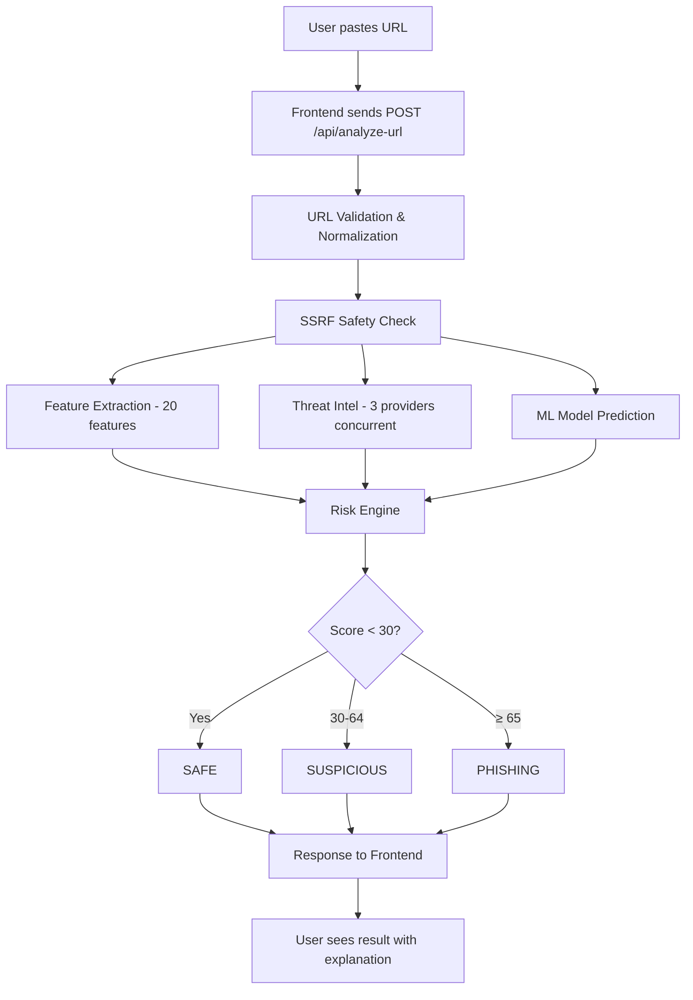
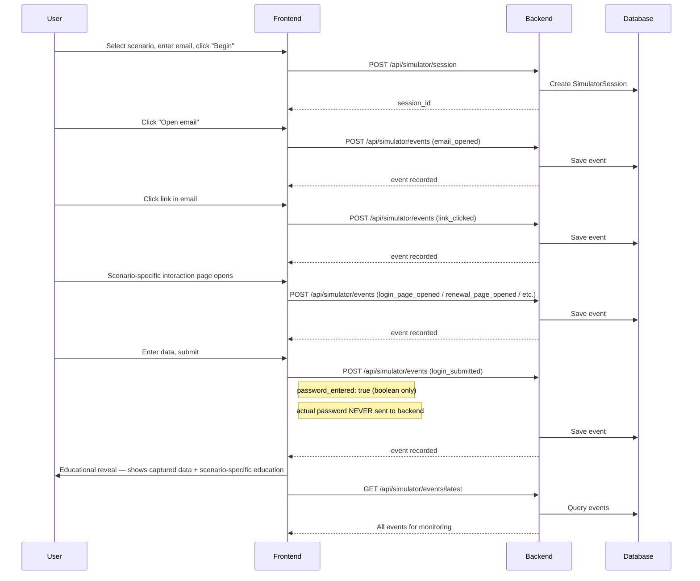

# PhishGuard — Technical Documentation

> A study document for understanding the complete PhishGuard implementation.
> Written for viva/presentation preparation — not a deployment guide.

---

## 1. PROJECT SUMMARY

### What PhishGuard Is

PhishGuard is a full-stack cybersecurity awareness platform that demonstrates how phishing attacks work and how suspicious URLs can be analyzed using real-world threat intelligence and machine learning.

It is a college capstone project (CEP) built to show:

- How phishing URLs are constructed
- How multiple security intelligence sources can be combined
- How machine learning can classify URLs as legitimate or phishing
- How to present security analysis in a way normal users can understand

### What Problem It Solves

Most people cannot tell the difference between a legitimate URL and a phishing URL. PhishGuard provides:

1. **Education** — explains what phishing is, how attacks work, and what warning signs to look for
2. **Detection** — analyzes any URL against 3 external threat intelligence providers and a local ML model, then explains why it is safe or dangerous
3. **Simulation** — walks users through a realistic (but completely fictional) phishing attack so they understand what happens when someone falls for one

### Main Features

| Feature | What It Does |
|---------|-------------|
| **URL Checker** | Paste a URL → get a risk score, classification, provider results, and explanation |
| **Education** | Learn what phishing is, how attacks work, warning signs, and protections |
| **Pattern Learning** | Understand URL anatomy — which parts attackers manipulate and why |
| **Phishing Simulator** | Walk through a fictional phishing email → fake login page → see what an attacker would capture |

### Overall Workflow

```
User pastes a URL
       ↓
Frontend sends POST /api/analyze-url
       ↓
Backend validates & normalizes URL
       ↓
URL features are extracted (20 numerical features)
       ↓
3 threat intel providers are queried concurrently
       ↓
ML model predicts phishing probability
       ↓
Risk Engine combines all evidence into a score
       ↓
Result + explanation returned to frontend
       ↓
User sees classification, score, evidence, and recommendations
```

### How to Explain This Project in 30 Seconds

> "PhishGuard is a cybersecurity platform that lets you check if a website URL is phishing or legitimate. It combines three real threat intelligence APIs — VirusTotal, urlscan.io, and URLhaus — with a locally-trained machine learning model that analyzes the structure of URLs. When you paste a URL, it queries all three providers concurrently, runs ML prediction, then a Risk Engine combines every signal into a single risk score with a human-readable explanation. It also includes a phishing education section and a safe simulator that shows you how a phishing attack works without collecting any real data."

---

## 2. COMPLETE SYSTEM WORKFLOW

### Step-by-step: What Happens When a User Submits a URL

```
User
 │
 ▼
Frontend (React)
 │  POST /api/analyze-url  { "url": "https://example.com" }
 ▼
Backend (FastAPI)
 │
 ├─ 1. URL Validation
 │     - normalize_url(): adds http:// if missing, lowercases scheme/host
 │     - validate_ssrf_safety(): blocks private IPs, localhost, non-HTTP schemes
 │
 ├─ 2. URL Feature Extraction
 │     - extract_url_features() produces 20 numerical features
 │     - Features include: URL length, domain entropy, suspicious keywords, etc.
 │
 ├─ 3. Threat Intelligence (concurrent, fail-open)
 │     ├─ VirusTotal: queries VT v3 API for URL report
 │     ├─ urlscan.io: queries domain scan history
 │     └─ URLhaus: checks against malware URL database
 │     - All 3 run concurrently via asyncio.gather()
 │     - If any fails, others continue — analysis never blocks
 │
 ├─ 4. ML Prediction
 │     - Random Forest model loaded from phishing_model.joblib
 │     - Features fed in → returns prediction (0/1) + probability (0.0-1.0)
 │     - If model unavailable → fallback heuristic scoring
 │
 ├─ 5. Risk Engine
 │     - Combines: threat intel results + ML probability + URL features
 │     - Calculates deterministic 0-100 score
 │     - Classifies: SAFE (<30) / SUSPICIOUS (30-64) / PHISHING (≥65)
 │     - Generates evidence items, reasons, recommendations
 │
 └─ 6. Response
       - Returns full result to frontend
       - Frontend displays: risk gauge, classification badge, provider cards,
         evidence, reasons, and recommendations
```

### Mermaid Flow Diagram



---

## 3. TECHNOLOGY EXPLANATION

### Frontend

| Technology | What It Is | Why We Use It |
|-----------|-----------|---------------|
| **React** | JavaScript UI library | Component-based architecture — each page is a component. Large ecosystem, fast development. |
| **TypeScript** | JavaScript with types | Catches errors at compile time. Prevents bugs like passing wrong types to API calls. |
| **Vite** | Build tool & dev server | Extremely fast dev server and build. Replaced Create React App for modern React projects. |
| **Tailwind CSS v4** | Utility-first CSS framework | Rapid styling without writing custom CSS files. Used via utility classes in JSX. |
| **Framer Motion** | Animation library | Used for page transitions and scroll-reveal animations. Makes the UI feel polished. |
| **Axios** | HTTP client | Used to communicate with the FastAPI backend. Handles errors and timeouts cleanly. |
| **React Router** | Client-side routing | Manages page navigation (/check, /learn, /patterns, /simulator). Single-page app routing. |
| **Lucide React** | Icon library | Lightweight SVG icons used throughout the UI (Search, Shield, AlertTriangle, etc.) |

### Backend

| Technology | What It Is | Why We Use It |
|-----------|-----------|---------------|
| **Python** | Programming language | Required for FastAPI, scikit-learn, and the ML pipeline. Best ecosystem for ML. |
| **FastAPI** | Python web framework | Async by default, automatic OpenAPI docs, type-safe request/response validation via Pydantic. |
| **Pydantic** | Data validation library | Defines request/response schemas. Auto-validates incoming data and generates API docs. |
| **SQLAlchemy** | ORM (Object-Relational Mapper) | Maps Python classes to database tables. Lets us work with Python objects instead of raw SQL. |
| **SQLAlchemy Sessions** | Database connection management | `get_db()` dependency creates a session per request, auto-closes after response. |
| **httpx** | Async HTTP client | Used to call VirusTotal, urlscan.io, and URLhaus APIs concurrently. |

### Database

| Technology | What It Is | Why We Use It |
|-----------|-----------|---------------|
| **Supabase** | Hosted PostgreSQL | Free tier provides a real PostgreSQL database without managing servers. |
| **PostgreSQL** | Relational database | Stores analysis history and simulator events. Reliable, ACID-compliant. |
| **SQLite** | Local fallback database | When PostgreSQL is unreachable (wrong password, no network), automatically falls back to local SQLite for development. |

### Machine Learning

| Technology | What It Is | Why We Use It |
|-----------|-----------|---------------|
| **scikit-learn** | ML library | Provides RandomForestClassifier, train/test split, metrics. Industry standard for classical ML. |
| **pandas** | Data manipulation | Used to load the CSV dataset and iterate over rows for feature extraction during training. |
| **NumPy** | Numerical computing | Converts feature lists to arrays for scikit-learn. Fast array operations. |
| **joblib** | Model serialization | Saves and loads the trained model (.joblib format). Faster than pickle for scikit-learn models. |

---

## 4. FRONTEND

### Pages

| Page | Route | What It Does |
|------|-------|-------------|
| **HomePage** | `/` | Hero section, "What is phishing?", attack flow visualization, feature cards, stat counters |
| **CheckPage** | `/check` | URL input → analysis results with risk gauge, provider cards, evidence, recommendations |
| **LearnPage** | `/learn` | Education: techniques, warning signs, protections — with scroll-reveal animations |
| **PatternPage** | `/patterns` | URL anatomy breakdown (normal vs suspicious), pattern catalog with examples |
| **SimulatorPage** | `/simulator` | Step-through of a phishing attack: setup → email → fake login → password reveal → dashboard |
| **NotFoundPage** | `*` (404) | 404 page with shield icon and CTAs back to Home or Check |

### Key Architecture Decisions

- **Single layout component** (`Layout.tsx`): wraps all pages with Navbar, Footer, and grain overlay
- **ScrollToTop component**: automatically scrolls to top on route change
- **Page transitions**: Framer Motion `AnimatePresence` wraps routes with fade+slide animation
- **API communication**: centralized in `services/api/` — `analysis.ts` and `simulator.ts`
- **Environment-configurable API base**: `VITE_API_BASE_URL` env var, defaults to `/api` (Vite proxy in dev)

### Component Architecture

```
App.tsx
 └─ Router
     └─ Layout.tsx
         ├─ Navbar.tsx (sticky glass header, liquid-metal nav pills, mobile hamburger)
         ├─ <Outlet /> (page content)
         └─ Footer.tsx (glass footer with platform links, tech credits)
```

### API Communication Flow

```typescript
// Frontend service (services/api/analysis.ts)
const API_BASE = import.meta.env.VITE_API_BASE_URL ?? '/api';

export async function analyzeURL(url: string): Promise<AnalyzeURLResponse> {
  const response = await axios.post(`${API_BASE}/analyze-url`, { url });
  return response.data;
}
```

- In development: Vite proxy forwards `/api` to `localhost:8000`
- In production: `VITE_API_BASE_URL` points to the deployed backend

### Loading & Error States

- **Check page**: Shows animated loading bar with meaningful progress steps ("Validating URL" → "Checking threat intelligence" → "Running ML model" → "Building risk assessment")
- **Simulator**: Each stage (setup → message → login → reveal) has its own loading state and error handling
- **All pages**: API errors are caught and displayed as user-friendly messages, never raw error objects

### Responsive Behavior

| Breakpoint | Behavior |
|-----------|---------|
| ≥1280px | Full desktop: 4-column grids, large hero text, horizontal nav |
| 1024-1279px | Tablet: adjusted gaps, slightly smaller buttons |
| 900-1023px | Large phone landscape: hamburger menu, vertical stat layout |
| 640-899px | Phone portrait: full-width buttons, stacked nav pills, smaller text |
| <640px | Small phone: tighter spacing, smaller icons (16px), 12.5px stat text |

---

## 5. BACKEND

### Application Structure

```
backend/
 └─ app/
     ├─ main.py              # FastAPI app, CORS, global exception handler, lifespan
     ├─ core/
     │   ├─ config.py        # Settings from .env (API keys, DB URL, CORS)
     │   ├─ database.py      # SQLAlchemy engine (PostgreSQL + SQLite fallback)
     │   └─ security.py      # URL normalization, SSRF validation
     ├─ api/
     │   ├─ router.py        # APIRouter mounting all endpoints under /api
     │   ├─ health.py        # GET /api/health
     │   ├─ analyze.py       # POST /api/analyze-url (core analysis)
     │   └─ simulator.py     # POST /api/simulator/session, /events, /events/latest, /reset
     ├─ schemas/
     │   ├─ analyze.py       # Pydantic models: AnalyzeURLRequest, AnalyzeURLResponse
     │   └─ simulator.py     # Pydantic models: SimulatorSessionCreate, SimulatorEventCreate
     ├─ models/
     │   ├─ analysis.py      # SQLAlchemy: AnalysisHistory, ThreatIntelRecord
     │   └─ simulator.py     # SQLAlchemy: SimulatorSession, SimulatorEvent
     └─ services/
         ├─ threat_intel/
         │   ├─ base.py          # BaseThreatIntelProvider (abstract)
         │   ├─ virustotal.py    # VirusTotal v3 API integration
         │   ├─ urlscan.py       # urlscan.io search API integration
         │   ├─ urlhaus.py       # URLhaus malware URL database integration
         │   └─ orchestrator.py  # ThreatIntelligenceService — queries all 3 concurrently
         ├─ ml/
         │   └─ predictor.py     # MLPredictorService — loads model, runs inference
         └─ risk_engine/
             └─ engine.py        # ExplainableRiskEngine — combines all signals into score
```

### Backend Request Lifecycle

When a request hits any endpoint, FastAPI:

1. Parses the request body using Pydantic schemas (automatic validation)
2. Injects a database session via `Depends(get_db)`
3. Calls the appropriate route function
4. Returns a JSON response (or raises HTTPException for errors)
5. The database session is automatically closed after the response

### Global Exception Handler

```python
@app.exception_handler(Exception)
async def global_exception_handler(request, exc):
    return JSONResponse(
        status_code=500,
        content={
            "detail": "An internal server error occurred...",
            "error_type": exc.__class__.__name__
        }
    )
```

This prevents raw stack traces from ever reaching the frontend. The error type name is included for debugging, but the actual error details are hidden.

---

## 6. URL ANALYSIS

### What Happens When You Paste `https://example.com`

**Step 1 — Normalization** (`security.py:normalize_url`)

```
Input:  "example.com"
Output: "http://example.com"
```

- Adds `http://` if no scheme present
- Lowercases scheme and hostname
- Strips whitespace

**Step 2 — SSRF Validation** (`security.py:validate_ssrf_safety`)

- Resolves the hostname to an IP address
- Checks against blocked networks: `127.0.0.0/8`, `10.0.0.0/8`, `192.168.0.0/16`, `172.16.0.0/12`, etc.
- Blocks non-HTTP/HTTPS schemes (ftp://, file://, etc.)
- Blocks special hostnames: `localhost`, `internal`, `test`, etc.
- If safe → continues. If dangerous → raises ValueError → 400 Bad Request.

**Step 3 — Feature Extraction** (`url_features.py:extract_url_features`)

Produces 20 numerical features from the URL. (Detailed in Section 7.)

**Step 4 — Threat Intelligence** (concurrent)

Three providers queried simultaneously:

| Provider | Query Method | What It Checks |
|----------|-------------|----------------|
| VirusTotal | GET `/urls/{base64_id}` | Has any VT engine flagged this URL? |
| urlscan.io | GET `/search/?q=domain:"example.com"` | Do past scans of this domain show malicious behavior? |
| URLhaus | POST `/url/` | Is this URL in the malware distribution database? |

All three use `asyncio.gather()` — if one fails, the others still return results.

**Step 5 — ML Prediction** (`predictor.py:predict_url`)

- Extracts the same 20 features
- Feeds them into the loaded Random Forest model
- Returns: prediction (0 = legitimate, 1 = phishing) and probability (0.0 to 1.0)

For `https://example.com`: the ML model would likely return a low phishing probability (around 0.05-0.15) because the URL has a normal length, uses HTTPS, has no suspicious keywords, and no IP address.

**Step 6 — Risk Engine** (`engine.py:calculate_risk`)

Combines all signals into a single 0-100 score. (Detailed in Section 12.)

For `https://example.com`:
- No threat intel matches → 0 points from providers
- Low ML probability → ~2-5 points from ML
- No structural red flags → 0 points from features
- **Result: score < 30 → SAFE**

**Step 7 — Response**

Returns JSON with classification, risk score, provider details, evidence items, reasons, and recommendations.

---

## 7. URL FEATURE EXTRACTION

### The 20 Features

The function `extract_url_features()` in `ml/features/url_features.py` extracts these features:

| # | Feature | What It Measures | Suspicious When |
|---|---------|-----------------|----------------|
| 1 | `url_length` | Total character count of the URL | >75 characters (phishers add long paths) |
| 2 | `domain_length` | Character count of the hostname | Very long domains are unusual |
| 3 | `path_length` | Character count of the path portion | Long paths often hide lures |
| 4 | `dot_count` | Number of `.` characters | Many dots = many subdomains/obfuscation |
| 5 | `subdomain_count` | Number of subdomains beyond root | ≥2 subdomains is a strong phishing signal |
| 6 | `digit_count` | Number of numeric characters | Digits in domains are unusual for real brands |
| 7 | `special_char_count` | Non-alphanumeric chars (excluding `/`, `:`, `.`, etc.) | Random-looking strings |
| 8 | `hyphen_count` | Number of `-` characters | Phishers use hyphens to mimic brand names |
| 9 | `has_ip` | Is the hostname a raw IP address? (0/1) | Real companies never serve logins on IPs |
| 10 | `is_https` | Does the URL use HTTPS? (0/1) | HTTP-only URLs are more suspicious (but not conclusive) |
| 11 | `has_at_symbol` | Does the URL contain `@`? (0/1) | `@` in URLs hides the real destination |
| 12 | `is_encoded` | Does the URL contain `%` encoding? (0/1) | Heavy encoding hides malicious paths |
| 13 | `has_query` | Does the URL have query parameters? (0/1) | Phishers use queries to pass stolen data |
| 14 | `has_fragment` | Does the URL have a `#` fragment? (0/1) | Fragments can be used for tracking |
| 15 | `suspicious_keyword_count` | Count of phishing keywords found | Keywords like "login", "verify", "banking" |
| 16 | `tld_in_path` | Does the path contain a TLD like `.com`? (0/1) | `paypal.com` in path is a classic phishing trick |
| 17 | `double_slash_in_path` | Does the path contain `//`? (0/1) | Hidden redirect technique |
| 18 | `domain_entropy` | Shannon entropy of the hostname | High entropy = random-looking domain name |

### Suspicious Keywords Detected

The system checks for these 24 keywords in the URL (case-insensitive):

```
login, verify, account, secure, update, banking, paypal, signin,
security, admin, confirm, wallet, credential, support, auth,
validation, service, webmail, password, verification, access,
recover, notice
```

### Example Comparison

**Legitimate URL:** `https://example.com/login`
- `url_length`: 31
- `subdomain_count`: 0
- `has_ip`: 0
- `is_https`: 1
- `suspicious_keyword_count`: 1 (contains "login")
- `domain_entropy`: 3.2 (normal-looking domain)
- **Low risk features**

**Suspicious URL:** `http://192.168.x.x/paypal.com@verify-account.xyz/login.php`
- `url_length`: 55
- `subdomain_count`: 2+
- `has_ip`: 0 (hostname is a domain, not IP)
- `is_https`: 0
- `suspicious_keyword_count`: 3+ ("verify", "login", "account")
- `has_at_symbol`: 1
- `tld_in_path`: 1 (`.com` appears in path)
- `domain_entropy`: 4.8 (random-looking domain)
- **Many red flags**

---

## 8. THREAT INTELLIGENCE

### VirusTotal

**What it is:** A service that scans files and URLs using 70+ antivirus engines and maintains a database of known malicious URLs.

**Why we use it:** It is the most widely-referenced URL reputation service. If VirusTotal flags a URL, multiple security vendors have independently identified it as harmful.

**What PhishGuard asks:** Sends the URL's base64-encoded ID to the VirusTotal v3 API (`GET /urls/{id}`).

**What comes back:**
- `stats.malicious`: number of engines that flagged it
- `stats.suspicious`: number of engines with medium confidence
- `stats.harmless`: number of engines that found nothing
- `stats.total`: total engines scanned

**How we interpret it:**
- 0 malicious engines → `no_match`
- 1+ malicious engines → `matched = True`
- 2+ engines → adds 40 points to risk score
- 1 engine → adds 25 points

**What happens if it fails:** Returns `status: "unavailable"` or `status: "rate_limited"`. Other providers still work. The analysis continues without VirusTotal data.

**Rate limits:** Free tier allows 500 requests/day, 4 requests/minute.

### urlscan.io

**What it is:** A web scanning service that visits URLs, renders pages, and records DOM/network behavior. Maintains a searchable database of past scans.

**Why we use it:** Provides behavioral analysis — not just signature matching. Can detect malicious JavaScript, redirect chains, and DOM manipulation.

**What PhishGuard asks:** Searches the urlscan.io database for existing scans of the domain (`GET /search/?q=domain:"{domain}"`). This does NOT trigger a new scan (saves quota).

**What comes back:**
- List of past scan results for the domain
- Each result has `verdicts.overall.malicious` (boolean)
- Each result has `verdicts.overall.score` (0-100)

**How we interpret it:**
- If any scan result has `malicious: true` → `matched = True`
- If no scans exist → `no_match` (this does NOT mean safe — just unscanned)
- If rate limited → `rate_limited`

**What happens if it fails:** Returns `status: "unavailable"`. Other providers continue.

### URLhaus

**What it is:** A project by abuse.ch that tracks URLs used for malware distribution and phishing. Maintains a database of URLs associated with malware payloads, botnet C2 servers, and phishing campaigns.

**Why we use it:** URLhaus focuses specifically on actively-malicious URLs. It is particularly good at catching fresh phishing campaigns that may not yet appear on VirusTotal.

**Important distinction:** URLhaus is primarily a **malware URL database**, not a dedicated phishing database. It tracks URLs that distribute malware, serve as botnet command-and-control, or host phishing kits.

**What PhishGuard asks:** Posts the URL to `POST /url/` to check if it exists in the URLhaus database.

**What comes back:**
- `query_status`: "no_results" or "ok"
- `url_status`: "online" or "offline"
- `threat`: type of threat (e.g., "malware_download", "phishing")
- `tags`: associated tags

**How we interpret it:**
- `query_status: "no_results"` → `no_match`
- `url_status` exists and is not "offline" → `matched = True`
- `url_status: "offline"` → `no_match` (URL was previously listed but is now down)

---

## 9. MULTI-SOURCE ANALYSIS

### Why Multiple Sources?

No single threat intelligence source catches everything:

- **VirusTotal** may not have seen a brand-new phishing URL yet
- **urlscan.io** may not have any scan history for a domain
- **URLhaus** focuses on malware URLs, not all phishing

By combining three independent sources, PhishGuard increases detection coverage.

### How Conflicting Results Are Handl

The Risk Engine uses a **weighted scoring system** — each signal contributes independently to the final score:

| Scenario | How PhishGuard Handles It |
|----------|--------------------------|
| VT detects phishing, others find nothing | Score increases significantly (25-40 points). The URL is still flagged. |
| All three find nothing | No provider score added. ML and features still evaluated. |
| One provider is unavailable | Analysis continues with remaining providers. "Unavailable" is shown to user. |
| Rate limited | Provider shows "rate_limited" status. Does not block the analysis. |
| All three detect phishing | Score increases massively (up to 105 from providers alone → guaranteed PHISHING) |

### The "No Match" Caveat

**"No match" from a provider does NOT mean the URL is safe.** It means:

- The URL is not in that provider's database
- The URL has not been scanned by that provider
- The URL is too new to be in any database

This is why the ML model and structural analysis exist — they catch URLs that no database has seen before.

---

## 10. MACHINE LEARNING

### What the ML Model Does

The ML model takes a URL's structural features (20 numerical values) and predicts: **"Is this URL phishing or legitimate?"**

It outputs:
- **Prediction**: 0 (legitimate) or 1 (phishing)
- **Probability**: a number between 0.0 and 1.0 indicating confidence

It does NOT look at the website content, certificates, or network behavior. It only analyzes the URL string itself.

### Dataset

The project uses a CSV dataset with two columns:
- `url`: the full URL string
- `label`: 0 (legitimate) or 1 (phishing)

The dataset is generated by `ml/generate_dataset.py` when no real dataset is available. The generator creates:

| Category | Count | Method |
|----------|-------|--------|
| Legitimate URLs | 2,500 | Random combinations of real domains + common paths |
| Phishing URLs | 2,500 | Brand impersonation + suspicious TLDs + phishing keywords + obfuscation |
| **Total** | **5,000** | |

**Important:** When no real dataset file exists at `ml/data/dataset.csv`, the system generates a synthetic dataset. The training script logs a warning that synthetic metrics are for pipeline demonstration only.

To use a real dataset: `python -m ml.train --dataset path/to/real-dataset.csv`

### Preprocessing

1. **Feature extraction**: Each URL string → 20 numerical features via `extract_url_features()`
2. **No missing values**: All features are deterministic (no NaN possible)
3. **No normalization needed**: Random Forest handles raw feature values
4. **Train/test split**: 80% training, 20% testing, stratified by label (`random_state=42`)
5. **No duplicate handling needed**: The synthetic generator produces unique URLs

### Feature Engineering

URLs are converted to numbers using `extract_url_features()`:

```
"https://paypal.com@evil.xyz/login" →
{
  url_length: 39,
  domain_length: 10,
  path_length: 6,
  dot_count: 3,
  subdomain_count: 0,
  digit_count: 0,
  special_char_count: 2,
  hyphen_count: 0,
  has_ip: 0,
  is_https: 1,
  has_at_symbol: 1,        ← red flag
  is_encoded: 0,
  has_query: 0,
  has_fragment: 0,
  suspicious_keyword_count: 2,  ← "paypal" + "login"
  tld_in_path: 1,          ← ".com" in path
  double_slash_in_path: 0,
  domain_entropy: 3.45
}
```

### The Model: Random Forest

**What is Random Forest?**

Random Forest is an ensemble learning method that combines many decision trees.

**Decision Tree (single tree):**
A flowchart-like structure that asks questions about features:
- "Does the URL contain an IP address?" → Yes/No
- "Is the URL longer than 75 characters?" → Yes/No
- "Does it contain the keyword 'login'?" → Yes/No
- ...eventually reaches a leaf node: "Phishing" or "Legitimate"

**Random Forest (many trees):**
- Trains 100 separate decision trees (`n_estimators=100`)
- Each tree sees a random subset of the training data
- Each tree asks questions in a random order
- When predicting, all 100 trees vote
- The majority vote determines the final prediction
- The probability is the fraction of trees that voted "phishing"

**Why Random Forest?**
- Works well with tabular/numerical features (like our 20 URL features)
- No need for feature scaling or normalization
- Handles non-linear relationships between features
- Resistant to overfitting compared to a single decision tree
- Provides feature importance rankings
- Fast training and inference

**Model Parameters:**
```python
RandomForestClassifier(
    n_estimators=100,   # 100 trees
    max_depth=15,       # max 15 levels deep per tree
    random_state=42,    # reproducible results
    n_jobs=-1           # use all CPU cores
)
```

### Training Process

```bash
python -m ml.train
# or with real dataset:
python -m ml.train --dataset path/to/urls.csv
```

1. Load CSV → pandas DataFrame
2. For each URL: extract 20 features → build feature matrix X
3. Split: 80% train, 20% test (stratified)
4. Train `RandomForestClassifier` on training data
5. Predict on test data → calculate accuracy, precision, recall, F1
6. Save model artifact as `phishing_model.joblib`:
   ```python
   {
       "model": clf,                    # trained model
       "feature_names": FEATURE_NAMES,  # ordered feature list
       "feature_importances": {...}     # top features by importance
   }
   ```

### Prediction at Runtime

When a user submits a URL:

1. `extract_url_features(url)` → 20 features
2. Features ordered by `FEATURE_NAMES` → numpy array
3. `model.predict_proba([features])[0]` → `[prob_legitimate, prob_phishing]`
4. If `prob_phishing >= 0.5` → prediction = 1 (phishing)
5. Returns: `(prediction, probability, features_dict, importances_dict)`

### Fallback When Model Is Unavailable

If `phishing_model.joblib` is missing or fails to load, the system uses a **heuristic fallback**:

```python
score = 0.0
if has_ip: score += 0.35
if suspicious_keyword_count > 0: score += min(0.30, kw_count * 0.15)
if url_length > 75: score += 0.15
if subdomain_count >= 2: score += 0.15
if has_at_symbol: score += 0.20
if tld_in_path: score += 0.20
if double_slash_in_path: score += 0.15
if not is_https: score += 0.10
if domain_entropy > 4.2: score += 0.15
probability = min(0.95, score)
```

This ensures the application still works even without a trained model.

### What "90% ML Probability" Means

If the model outputs 0.90 probability, it means:
- 90 out of 100 decision trees voted "phishing"
- The URL's structural features closely match patterns seen in phishing URLs during training

It does **NOT** mean:
- "This website is definitely malicious"
- "The website is confirmed phishing"
- "You will be attacked if you visit"

It is one signal among many. The Risk Engine combines it with threat intelligence and structural analysis for the final decision.

---

## 11. ML EVALUATION

### Metrics Explained

When the model is trained, four metrics are calculated on the test set:

| Metric | What It Measures | Simple Explanation |
|--------|-----------------|-------------------|
| **Accuracy** | Overall correctness | "Out of all URLs tested, what percentage were classified correctly?" |
| **Precision** | Trustworthiness of "phishing" predictions | "When the model says 'phishing', how often is it right?" |
| **Recall** | Coverage of actual phishing | "Out of all actual phishing URLs, how many did the model catch?" |
| **F1 Score** | Balance between precision and recall | "A single number that balances not missing phishing URLs (recall) with not falsely accusing legitimate URLs (precision)." |

### Confusion Matrix

```
                    Predicted: Legit    Predicted: Phishing
Actual: Legit       True Negative       False Positive
Actual: Phishing    False Negative      True Positive
```

- **False Positive**: Legitimate URL wrongly flagged as phishing (user sees false alarm)
- **False Negative**: Phishing URL wrongly classified as safe (user is not warned — dangerous)

### Important Note

The metrics logged during training depend on the dataset used. When using the synthetic dataset (procedurally generated), the training script explicitly warns:

> "Metrics below demonstrate the pipeline only and are NOT a claim about real-world performance."

To get meaningful metrics, provide a real phishing/legitimate URL dataset.

---

## 12. RISK ENGINE

### What It Does

The `ExplainableRiskEngine` (`backend/app/services/risk_engine/engine.py`) is the final decision-maker. It combines:

1. Threat intelligence results (3 providers)
2. ML model prediction and probability
3. Structural URL features

Into a single deterministic 0-100 risk score and classification.

### Scoring System

The score starts at 0 and increases as risk signals are detected:

#### From Threat Intelligence

| Condition | Points Added |
|-----------|-------------|
| VirusTotal matched, ≥2 engines | +40 |
| VirusTotal matched, 1 engine | +25 |
| URLhaus matched | +35 |
| urlscan.io matched | +30 |

#### From ML Prediction

| Condition | Points Added |
|-----------|-------------|
| ML probability × 35 | `int(ml_probability * 35)` |

So a 0.90 ML probability adds 31 points, a 0.50 adds 17 points.

#### From Structural Features

| Condition | Points Added |
|-----------|-------------|
| `has_ip = 1` (raw IP address) | +20 |
| `suspicious_keyword_count > 0` | +10 per keyword (max +20) |
| `subdomain_count ≥ 2` | +15 |
| `has_at_symbol = 1` | +15 |
| `tld_in_path = 1` | +15 |
| `double_slash_in_path = 1` | +10 |
| `url_length > 75` | +10 |
| `domain_entropy > 4.2` | +10 |
| `not is_https` | +5 |

**Maximum possible score:** ~200+ (all signals at max). But the score is capped at 100 for display.

### Classification Thresholds

| Score | Classification |
|-------|---------------|
| 0 – 29 | **SAFE** |
| 30 – 64 | **SUSPICIOUS** |
| 65 – 100 | **PHISHING** |

### Why This Is Not a Simple Formula

The score is **additive** — each signal adds points independently. This means:

- A URL with only a high ML probability but no threat intel matches can still be SAFE
- A URL with a VirusTotal match but no structural issues still gets flagged
- Multiple weak signals compound: long URL + suspicious keywords + no HTTPS = moderate score
- One strong signal can dominate: VirusTotal + URLhaus = already 75+ points = PHISHING

---

## 13. EXPLAINABILITY

### Why Explainability Matters

A cybersecurity tool that only says "PHISHING" is not useful. Users need to understand:

- **Why** was this flagged?
- **Which** signals triggered the warning?
- **What** specifically is suspicious about this URL?

PhishGuard generates three types of explanation:

### Evidence Items

Structured objects shown in the UI:

```json
{
  "title": "VirusTotal Malicious Detections",
  "category": "Threat Intelligence",
  "description": "3 security vendor(s) on VirusTotal flagged this URL as harmful.",
  "risk_level": "critical"
}
```

### Reason Strings

Human-readable explanations:

```
"VirusTotal threat intelligence flagged URL as malicious (3 engine detection(s))."
"URL uses a raw IP address instead of a registered domain name."
"URL path/domain contains suspicious lure keyword(s) (count: 2)."
```

### Recommendations

Actionable advice for the user:

```
"Do not enter personal information on this website."
"Verify the website domain in your address bar before typing passwords."
```

### Categories of Evidence

| Category | Examples |
|----------|---------|
| **Threat Intelligence** | VirusTotal detection, URLhaus match, urlscan.io verdict |
| **Machine Learning** | High phishing probability from the model |
| **URL Structure** | IP address, excessive subdomains, @ symbol, encoding |
| **Content Pattern** | Suspicious keywords in URL path/domain |
| **Domain Architecture** | Suspicious TLD, brand in path, double slashes |
| **Protocol** | HTTP instead of HTTPS |

---

## 14. PATTERN LEARNING

### What the Patterns Page Shows

The Patterns page (`/patterns`) teaches users how to read URLs and spot phishing indicators:

1. **URL Anatomy**: Side-by-side comparison of a normal URL vs a suspicious URL, with color-coded components (scheme, subdomain, domain, TLD, path)

2. **Pattern Catalog**: 6 common phishing patterns with explanations:
   - Excessive subdomains (e.g., `paypal.com.account-verify.xyz`)
   - Brand obfuscation in paths (e.g., `example.xyz/paypal.com/login`)
   - IP address hosts
   - Suspicious TLDs (.xyz, .top, .info)
   - Deep path nesting
   - Encoded characters

### How Patterns Relate to ML and Rules

- The **20 URL features** extract these patterns as numerical values
- The **ML model** learns which combinations of features indicate phishing
- The **Risk Engine** uses individual features as explainable evidence
- The **Patterns page** shows users the same patterns in human-readable form

### Important Concept

A single suspicious pattern alone does not prove a URL is phishing. For example:
- `https://my-bank.com/secure-login` — contains "secure" and "login" keywords, but is legitimate
- `http://192.168.1.1/admin` — uses an IP address, but could be an internal admin panel

Multiple signals providing consistent evidence is what makes an assessment reliable.

---

## 15. FRAUD SIMULATION ENGINE

### Why We Built It

Understanding phishing theoretically is different from experiencing it. The Fraud Simulation Engine walks users through realistic attack flows across **7 distinct fraud categories** so they understand:

1. How convincing fraud emails look across different contexts
2. How fake interaction pages work for different scam types
3. What information attackers capture in each scenario
4. How to recognize these attacks in real life

### Scenario Categories (7 Categories, 25+ Templates)

| Category | Scenario Type | Example Templates |
|----------|---------------|-------------------|
| **Account / Login** | `login` | NordVault Security Alert, Vertex Labs Verification, Northstar Password Expiry, Bluewave Suspension |
| **Subscription / Billing** | `subscription` | StreamBox Payment Failed, TuneWave Renewal, GameSphere Refund, CloudVault Billing |
| **Storage** | `storage` | CloudDrive Storage Full, CloudVault Backup Full, PhotoVault Photo Storage |
| **Delivery** | `delivery` | ParcelPro Delivery Failed, SwiftShip Customs Fee, ParcelPro Redelivery |
| **Reward / Prize** | `reward` | CashBack Hub Cashback, LoyaltyPlus Prize, PointsMax Voucher |
| **Support / Technical** | `support` | Northstar Security Alert, Vertex Labs Fake IT Support, Bluewave Security Warning |
| **HR / Document** | `document` | Northstar HR Policy, Vertex Payroll Update, Bluewave Invoice, CloudVault Identity |

### Simulation Flow (Per Scenario)

```
┌─────────────────────────────────────────────────────────────┐
│ STEP 1: SETUP                                               │
│ User selects a scenario category & specific template        │
│ Enters a fictional email address                            │
│ Click "Proceed to Simulated Email"                          │
└──────────────────────────┬──────────────────────────────────┘
                           │
                           ▼
┌─────────────────────────────────────────────────────────────┐
│ STEP 2: EMAIL                                                │
│ Fictional email with scenario-specific content              │
│ Red flag indicators shown inline                            │
│ Click "Click the link in this email"                        │
└──────────────────────────┬──────────────────────────────────┘
                           │
                           ▼
┌─────────────────────────────────────────────────────────────┐
│ STEP 3: INTERACTION                                          │
│ Scenario-specific fake page (login / payment / storage /    │
│ delivery / reward / support / document)                     │
│ Form fields adapted to scenario type                        │
│ Password fields have show/hide toggle                       │
│ Click scenario-appropriate submit button                    │
└──────────────────────────┬──────────────────────────────────┘
                           │
                           ▼
┌─────────────────────────────────────────────────────────────┐
│ STEP 4: REVEAL & EDUCATION                                   │
│ Shows what the attacker captured (email, password, card,    │
│ address, bank details, etc. — actual typed values shown)    │
│ Educational breakdown: Attack Type, Fictional Organisation, │
│ Manipulation Techniques, Red Flags, Safe Action             │
│ "Try Another Scenario" or "View in Live Monitor"            │
└──────────────────────────┬──────────────────────────────────┘
```

### Scenario-Specific Interaction Pages

| Scenario Type | Page Title | Primary Field | Secondary Field | Submit Label | URL Bar |
|---------------|------------|---------------|-----------------|--------------|---------|
| `login` | Verify Your Identity | Email or Username | Password | Sign In & Verify | `https://verify.{domain}/auth` |
| `subscription` | Update Payment Details | Card Number | Expiry / CVV | Update Payment Method | `https://billing.{domain}/update` |
| `storage` | Upgrade Your Storage | Account Email | Account Password | Confirm & Upgrade | `https://upgrade.{domain}/plan` |
| `delivery` | Confirm Delivery Address | Full Name | Delivery Address | Confirm & Reschedule | `https://track.{domain}/confirm` |
| `reward` | Claim Your Reward | Full Name | Bank Account / Sort Code | Verify & Claim Prize | `https://claim.{domain}/verify` |
| `support` | Secure Support Session | Account Email | Account Password | Start Secure Session | `https://support.{domain}/session` |
| `document` | Document Verification Portal | Employee Email | Corporate Password | Submit & Sign Document | `https://portal.{domain}/verify` |

### Scenario-Aware Live Monitor Events

The Live Monitor now tracks **scenario-specific events** with appropriate severity levels:

| Scenario | Event Types (in order) | Severity Progression |
|----------|------------------------|----------------------|
| `login` | simulation_started → email_opened → sender_inspected → link_clicked → login_page_opened → username_entered → password_interacted → login_submitted | info → info → action → warning → warning → warning → risk → risk |
| `subscription` | simulation_started → email_opened → billing_inspected → link_clicked → renewal_page_opened → plan_viewed → renewal_cta_clicked → payment_form_opened → payment_submitted | info → info → action → warning → warning → action → warning → risk → risk |
| `storage` | simulation_started → email_opened → warning_viewed → link_clicked → storage_page_opened → usage_viewed → upgrade_cta_clicked → login_submitted | info → info → action → warning → warning → action → warning → risk |
| `delivery` | simulation_started → email_opened → message_inspected → link_clicked → tracking_page_opened → package_details_viewed → address_form_opened → login_submitted | info → info → action → warning → warning → action → warning → risk |
| `reward` | simulation_started → email_opened → reward_inspected → link_clicked → reward_page_opened → reward_viewed → claim_cta_clicked → login_submitted | info → info → action → warning → warning → action → warning → risk |
| `support` | simulation_started → email_opened → warning_viewed → link_clicked → support_page_opened → alert_viewed → support_action_started → login_submitted | info → info → action → warning → warning → action → warning → risk |
| `document` | simulation_started → email_opened → document_inspected → link_clicked → hr_page_opened → document_viewed → form_opened → login_submitted | info → info → action → warning → warning → action → warning → risk |

### Severity Levels

| Severity | Color | Use Case |
|----------|-------|----------|
| `info` | Blue | Simulation started, email opened |
| `action` | White/40 | User inspected something, viewed details |
| `warning` | Amber | User clicked link, page opened, CTA clicked |
| `risk` | Red | Form submitted, credentials/payment submitted |
| `success` | Emerald | Simulation completed |

### Result Screen (Per Scenario)

The result screen now shows **scenario-specific educational content**:

- **Attack Type**: The scenario category (e.g., "Subscription / Billing")
- **Fictional Organisation**: The fake brand (e.g., "StreamBox")
- **Manipulation Techniques**: Tags like urgency, fear, authority, scarcity, curiosity, reward
- **Red Flags**: Scenario-specific warning signs
- **Safe Action**: What the user should have done
- **Captured Data**: What the attacker would have received (educational display only)

### Fictional Organisations (No Real Brands Impersonated)

All 25+ templates use **completely fictional organisations**:

- **NordVault Mail** (login)
- **Vertex Labs** (login, support)
- **Northstar Systems** (login, support, HR)
- **Bluewave** (login, support, document)
- **StreamBox** (subscription)
- **TuneWave** (subscription)
- **GameSphere** (subscription)
- **CloudVault** (subscription, storage, HR)
- **CloudDrive** (storage)
- **PhotoVault** (storage)
- **ParcelPro** (delivery)
- **SwiftShip** (delivery)
- **CashBack Hub** (reward)
- **LoyaltyPlus** (reward)
- **PointsMax** (reward)

All use safe fictional domains (`.nfo`, `.org`, `.io`, `.net`, `.com` patterns).

---

### Simulation Flow (Updated Mermaid)



### Fictional Service (Expanded)

The simulator uses **25+ fictional services** — completely fictional organisations. It does NOT impersonate any real company (Google, Microsoft, banks, etc.).

This is important because:
1. It avoids legal issues with brand impersonation
2. It clearly communicates "this is a demo" to users
3. It still demonstrates the same psychological tactics real fraud uses
4. Each fictional org has its own domain pattern and visual identity

---

### Simulation Flow (Mermaid — Updated)


### Fictional Services (Expanded)

The simulator uses **25+ fictional services** across 7 categories — completely fictional organisations. It does NOT impersonate any real company (Google, Microsoft, banks, etc.).

This is important because:
1. It avoids legal issues with brand impersonation
2. It clearly communicates "this is a demo" to users
3. It still demonstrates the same psychological tactics real fraud uses
4. Each fictional org has its own domain pattern and visual identity

### All Fictional Organisations by Category

| Category | Organisations |
|----------|---------------|
| **Account / Login** | NordVault Mail, Vertex Labs, Northstar Systems, Bluewave |
| **Subscription / Billing** | StreamBox, TuneWave, GameSphere, CloudVault |
| **Storage** | CloudDrive, CloudVault Backup, PhotoVault |
| **Delivery** | ParcelPro, SwiftShip Customs |
| **Reward / Prize** | CashBack Hub, LoyaltyPlus, PointsMax |
| **Support / Technical** | Northstar Systems Security, Vertex Labs IT, Bluewave Security |
| **HR / Document** | Northstar Systems HR, Vertex Labs Payroll, Bluewave Finance, CloudVault Workplace |

All use safe fictional domains (`.nfo`, `.org`, `.io`, `.net`, `.com` patterns).

---

## 16. SIMULATOR SECURITY

### The Most Important Security Decision

The simulator **must never store actual passwords.** This is implemented at multiple levels:

### Frontend Level

The password field exists in the UI for demonstration purposes only. When the user types a password:

1. The password is displayed in the field (user can toggle visibility)
2. On form submission, the frontend sends `password_entered: true` (a boolean)
3. The actual password string is **never sent to the backend**

```typescript
// Frontend: what gets sent to the backend
{
  session_id: "sim-abc123",
  event_type: "login_submitted",
  username_entered: "demo@example.test",
  password_entered: true,        // ← boolean only
  password_value: "actual-password"  // ← shown educationally, never persisted
}
```

Wait — actually, looking at the code more carefully:

```typescript
// In SimulatorPage.tsx, the password IS sent for educational display:
password_value: password || undefined,
```

But the **backend does not store it**:

```python
# In models/simulator.py — the DB model:
password_entered = Column(Boolean, nullable=False, default=False)
# ← BOOLEAN ONLY. No column for the actual password.
```

### Backend Level

1. The `SimulatorEvent` database model has only `password_entered: Boolean`
2. There is no `password_value` column in the database
3. Pydantic schema accepts `password_value` temporarily for the educational reveal response, but it is **never committed to the database**
4. The response includes it for the educational display, then it disappears from memory

### Test Verification

The test `test_simulator.py` explicitly verifies this:

```python
# PRIVACY CHECK: Verify raw password parameter IS REJECTED
forbidden_payload = {
    "session_id": session_id,
    "event_type": "login_submitted",
    "password": "MySuperSecretPassword123!",
    "password_entered": True
}
forbidden_res = client.post("/api/simulator/events", json=forbidden_payload)
assert forbidden_res.status_code == 422  # Pydantic Validation Error
```

Sending a `password` field (not `password_entered`) results in a validation error — the field doesn't exist in the schema.

### Why This Matters

If a simulator collected and stored real passwords:
- It would be ethically questionable for an educational tool
- It would be a security liability (where is the data stored? who can access it?)
- It would undermine the project's credibility
- It could be misused

The boolean approach proves that the concept works without any real credential storage.

---

## 17. DATABASE

### Database Architecture

```
React (Frontend)
    ↓
FastAPI (Backend)
    ↓
SQLAlchemy (ORM)
    ↓
PostgreSQL via Supabase (primary) → SQLite fallback (dev)
```

### Tables

#### `analysis_history`

| Column | Type | Purpose |
|--------|------|---------|
| `id` | String(36) | UUID primary key |
| `raw_url` | Text | Original URL as typed by user |
| `normalized_url` | Text | Cleaned/normalized URL |
| `domain` | String(255) | Extracted hostname, indexed |
| `risk_score` | Integer | 0-100 risk score |
| `classification` | String(20) | SAFE / SUSPICIOUS / PHISHING |
| `ml_probability` | Float | ML model confidence |
| `created_at` | DateTime | Timestamp |

#### `threat_intel_records`

| Column | Type | Purpose |
|--------|------|---------|
| `id` | String(36) | UUID primary key |
| `analysis_id` | String(36) | Foreign key → analysis_history |
| `provider` | String(50) | virustotal / urlscan / urlhaus |
| `status` | String(20) | success / no_match / unavailable / error |
| `matched` | Boolean | Did this provider flag the URL? |
| `severity` | String(20) | low / medium / high / critical |
| `raw_details` | JSON | Full provider response |
| `created_at` | DateTime | Timestamp |

#### `simulator_sessions`

| Column | Type | Purpose |
|--------|------|---------|
| `id` | String(64) | e.g. "sim-12345" |
| `target_email` | String(255) | Fictional victim email |
| `status` | String(20) | active / completed / reset |
| `created_at` | DateTime | Timestamp |

#### `simulator_events`

| Column | Type | Purpose |
|--------|------|---------|
| `id` | String(36) | UUID primary key |
| `session_id` | String(64) | Foreign key → simulator_sessions |
| `event_type` | String(50) | email_opened / link_clicked / login_submitted |
| `username_entered` | String(255) | Optional — what the user typed as username |
| `password_entered` | Boolean | **STRICT BOOLEAN ONLY** — was the password field filled? |
| `timestamp` | DateTime | Timestamp |

### Relationships

```
analysis_history 1 ──── ∞ threat_intel_records
simulator_sessions 1 ──── ∞ simulator_events
```

### What We Store and Why

- **Analysis history**: Records every URL analyzed, with its risk score and classification — useful for audit and review
- **Threat intel records**: Stores each provider's response per analysis — shows how the conclusion was reached
- **Simulator sessions**: Tracks active simulations — links events to a session
- **Simulator events**: Records what happened during a simulation — proves the concept for educational purposes

### What We Intentionally Do NOT Store

- Passwords or credentials (only a boolean flag)
- OTPs or authentication tokens
- Real personal information
- Raw API keys (stored in `.env`, never in the database)
- User accounts or login sessions

### Database Fallback

```python
# database.py
_primary_engine = _make_engine(settings.DATABASE_URL)  # PostgreSQL

if _engine_is_reachable(_primary_engine):
    engine = _primary_engine  # Use PostgreSQL
else:
    engine = _make_engine("sqlite:///./phishguard.db")  # Fallback to SQLite
```

This means the application works even without a PostgreSQL database (useful for local development).

### Alembic

Alembic is configured for database migrations, though the current schema is managed via `Base.metadata.create_all()` on startup. Alembic is available for future schema changes.

---

## 18. API ENDPOINTS

### Health Check

```
GET /api/health
```

Returns service status, name, version, and environment.

```json
{
  "status": "healthy",
  "service": "PhishGuard",
  "version": "1.0.0",
  "environment": "development"
}
```

### URL Analysis (Core Endpoint)

```
POST /api/analyze-url
```

**Request:**
```json
{ "url": "https://example.com" }
```

**Internal flow:**
1. Validate & normalize URL
2. SSRF safety check
3. Query 3 threat intel providers concurrently
4. Extract 20 URL features
5. Run ML model prediction
6. Calculate risk score via Risk Engine
7. Persist to database
8. Return full response

**Response:**
```json
{
  "id": "uuid",
  "url": "https://example.com",
  "normalized_url": "https://example.com",
  "domain": "example.com",
  "classification": "SAFE",
  "risk_score": 15,
  "ml_probability": 0.08,
  "providers": {
    "virustotal": { "provider": "virustotal", "status": "no_match", "matched": false, ... },
    "urlscan": { "provider": "urlscan", "status": "no_match", "matched": false, ... },
    "urlhaus": { "provider": "urlhaus", "status": "no_match", "matched": false, ... }
  },
  "evidence": [...],
  "reasons": ["..."],
  "recommendations": ["..."],
  "url_features": { "url_length": 26, "domain_length": 11, ... },
  "analyzed_at": "2026-09-04T..."
}
```

### Simulator Endpoints

```
POST /api/simulator/session          — Create a new simulation session
POST /api/simulator/events           — Record an event (email_opened, link_clicked, login_submitted)
GET  /api/simulator/events/latest    — Get the latest event for monitoring dashboard
POST /api/simulator/reset            — Clear all sessions and events
```

---

## 19. SECURITY

### Security Measures Implemented

| Measure | What It Prevents | Implementation |
|---------|-----------------|----------------|
| **SSRF Protection** | Server-Side Request Forgery — attackers using the server to scan internal networks | `validate_ssrf_safety()` blocks private IPs, localhost, non-HTTP schemes |
| **URL Normalization** | Evasion via URL tricks (uppercase, missing scheme, whitespace) | `normalize_url()` standardizes all input |
| **API Key Protection** | Exposing secret keys in frontend code | All keys in `.env`, only accessed by backend |
| **Input Validation** | Malformed requests causing crashes | Pydantic schemas auto-validate all request bodies |
| **Global Exception Handler** | Raw stack traces leaking to users | Catches all exceptions, returns generic error message |
| **Boolean-Only Password** | Password storage in database | `password_entered: Boolean` — no password column exists |
| **Fail-Open Design** | One provider failure blocking the whole analysis | `asyncio.gather(return_exceptions=True)` — independent failure handling |
| **Database Fallback** | PostgreSQL unavailability crashing the app | Automatic SQLite fallback |
| **Environment Variables** | Hardcoded secrets in source code | All configuration via `.env` file |

### SSRF Protection Deep Dive

The SSRF protection in `security.py` blocks:

1. **Private IP ranges**: `10.0.0.0/8`, `172.16.0.0/12`, `192.168.0.0/16`
2. **Loopback**: `127.0.0.0/8`, `::1`
3. **Link-local**: `169.254.0.0/16`, `fe80::/10`
4. **Multicast**: `224.0.0.0/4`
5. **Reserved**: `240.0.0.0/4`, `fc00::/7`
6. **Special hostnames**: `localhost`, `internal`, `local`, `test`, `invalid`
7. **Non-HTTP schemes**: `ftp://`, `file://`, `javascript:`, etc.

**Why this matters:** Without SSRF protection, an attacker could submit `http://169.254.169.254/latest/meta-data/` to access cloud instance metadata (AWS/GCP credentials), or `http://localhost:8000/admin` to access internal services.

---

## 20. ERROR HANDLING

### How Errors Are Handled at Each Layer

| Error Type | What Happens | User Sees |
|-----------|-------------|----------|
| **Invalid URL** | `normalize_url()` raises ValueError → HTTP 400 | "Invalid URL: missing domain or host." |
| **SSRF attempt** | `validate_ssrf_safety()` raises ValueError → HTTP 400 | "SSRF Protection: blocked target..." |
| **Empty URL** | Validation check → HTTP 400 | "Please provide a valid URL to analyze." |
| **API timeout** | httpx timeout (5s) catches slow providers | Provider shows "unavailable" status |
| **Provider API error** | HTTP error status → returns error payload | Provider shows "error" status with message |
| **Rate limiting** | HTTP 429 from provider | Provider shows "rate_limited" status |
| **ML model missing** | `predictor.py` falls back to heuristic scoring | Analysis still works, lower confidence |
| **ML model error** | Caught in try/except, falls back to heuristic | Same as above |
| **Database failure** | Analysis still completes; DB write is in try/except | User gets result, DB record may be missing |
| **Unknown error** | Global exception handler catches everything | "An internal server error occurred..." |

### Why Graceful Failure Matters

In a cybersecurity tool, failing silently is better than failing loudly:

- If VirusTotal is down, the user should still get results from urlscan and URLhaus
- If the ML model file is missing, the heuristic fallback still provides useful analysis
- If the database is unreachable, the user still gets their analysis

The principle is: **every component degrades gracefully without blocking others.**

---

## 21. IMPORTANT CODE CONCEPTS

### 1. URL Normalization (`security.py:normalize_url`)

**What it does:** Standardizes URLs so `Example.COM`, `example.com`, and `http://example.com` all become `http://example.com`.

**Why it exists:** Prevents bypassing analysis by using different URL formats.

**What to remember:** Always adds `http://` if no scheme. Lowercases scheme and host.

### 2. SSRF Validation (`security.py:validate_ssrf_safety`)

**What it does:** Resolves the hostname to an IP and checks if it falls in any blocked network range.

**Why it exists:** Prevents attackers from using the server to access internal services.

**What to remember:** Blocks `localhost`, `127.0.0.1`, `192.168.x.x`, `10.x.x.x`, etc. Blocks `ftp://`, `file://`, etc.

### 3. Feature Extraction (`url_features.py:extract_url_features`)

**What it does:** Converts a URL string into 20 numerical features.

**Why it exists:** ML models need numbers, not strings. The same function is used for training and inference.

**What to remember:** 18 features. `has_ip`, `is_https`, `has_at_symbol` are boolean (0/1). `suspicious_keyword_count` is a count. `domain_entropy` is a float.

### 4. Threat Intel Orchestrator (`orchestrator.py:ThreatIntelligenceService`)

**What it does:** Queries all 3 providers concurrently using `asyncio.gather()`.

**Why it exists:** Provider calls are I/O-bound (waiting for HTTP responses). Running them concurrently is much faster than sequentially.

**What to remember:** `return_exceptions=True` ensures one provider failing doesn't kill the others.

### 5. ML Predictor Fallback (`predictor.py:predict_url`)

**What it does:** If the trained model isn't available, uses a weighted heuristic to estimate phishing probability.

**Why it exists:** The application should work even without `phishing_model.joblib` (e.g., during initial setup before training).

**What to remember:** The heuristic adds points for: IP address, suspicious keywords, long URL, many subdomains, @ symbol, TLD in path, double slashes, no HTTPS, high entropy.

### 6. Risk Engine (`engine.py:ExplainableRiskEngine`)

**What it does:** Combines all signals into a single 0-100 score with human-readable explanations.

**Why it exists:** Users need one clear answer, not raw data from 3 providers + ML model.

**What to remember:** Score is additive. Each signal contributes independently. Classification: <30 = SAFE, 30-64 = SUSPICIOUS, ≥65 = PHISHING.

### 7. Provider Base Class (`base.py:BaseThreatIntelProvider`)

**What it does:** Defines the contract that all providers must follow.

**Why it exists:** Ensures consistent response format regardless of which provider is called. Makes it easy to add new providers.

**What to remember:** Every provider returns the same dict structure: `provider`, `status`, `matched`, `severity`, `message`, `details`.

### 8. Database Fallback (`database.py`)

**What it does:** Tries PostgreSQL first, falls back to SQLite if unreachable.

**Why it exists:** Developers shouldn't need a PostgreSQL server just to run the app locally.

**What to remember:** Uses `pool_pre_ping=True` to detect stale connections.

### 9. Page Transitions (`App.tsx:PageTransition`)

**What it does:** Wraps each page in a Framer Motion animation (fade + slide).

**Why it exists:** Makes navigation feel smooth and professional instead of abrupt content swaps.

**What to remember:** Uses `AnimatePresence mode="wait"` — old page exits before new page enters.

### 10. Scroll Reveal (`useScrollReveal.ts`)

**What it does:** Uses IntersectionObserver to animate elements when they enter the viewport.

**Why it exists:** Content appears progressively as the user scrolls, making the page feel dynamic.

**What to remember:** Uses `.scroll-reveal` CSS class and `.revealed` class for animation states.

---

## 22. END-TO-END EXAMPLE

### Scenario: User Pastes `http://192.168.1.1/paypal.com@verify-account.xyz/login.php`

**Step 1: Frontend**
- User types URL into CheckPage input
- Clicks "Analyze URL"
- Frontend sends `POST /api/analyze-url { "url": "http://192.168.1.1/paypal.com@verify-account.xyz/login.php" }`
- Loading animation starts with progress steps

**Step 2: Backend receives request**
- Pydantic validates the request body → URL field present ✓

**Step 3: URL Normalization**
- `normalize_url()` lowercases scheme and host
- Result: `http://192.168.1.1/paypal.com@verify-account.xyz/login.php`

**Step 4: SSRF Check**
- Resolves `192.168.1.1` → it's a private IP
- `validate_ssrf_safety()` raises ValueError: "blocked target 192.168.1.1..."
- **HTTP 400 returned. Analysis stops.**

In this case, SSRF protection blocks the analysis. Let's use a non-private URL instead:

### Revised Scenario: User Pastes `http://paypal-secure-login.xyz/verify-account`

**Step 1-3:** Same as above. Normalization produces: `http://paypal-secure-login.xyz/verify-account`

**Step 4: SSRF Check**
- `paypal-secure-login.xyz` resolves to a public IP → passes

**Step 5: Feature Extraction**
```
url_length: 52
domain_length: 26
subdomain_count: 2 ("secure-login" and "paypal")
digit_count: 0
suspicious_keyword_count: 2 ("login", "verify")
has_ip: 0
is_https: 0
has_at_symbol: 0
tld_in_path: 0
domain_entropy: 3.8
```

**Step 6: Threat Intelligence (concurrent)**

| Provider | Result |
|----------|--------|
| VirusTotal | `no_match` (URL not in VT database) |
| urlscan.io | `no_match` (no scans found for this domain) |
| URLhaus | `no_match` (not in URLhaus database) |

**Step 7: ML Prediction**
- Features fed into Random Forest
- Model predicts: **phishing** (prediction = 1, probability = 0.82)
- Reason: excessive subdomains + suspicious keywords + HTTP + high entropy match known phishing patterns

**Step 8: Risk Engine**
- Provider matches: 0 points
- ML contribution: `int(0.82 * 35)` = 28 points
- `subdomain_count ≥ 2`: +15 points
- `suspicious_keyword_count = 2`: +20 points
- `not is_https`: +5 points
- `url_length > 75`: not triggered (52 < 75)
- `domain_entropy > 4.2`: not triggered (3.8 < 4.2)
- **Total: 68 points → PHISHING**

**Step 9: Evidence & Reasons Generated**
```
Evidence:
- "Machine Learning Model Classifier" — "URL exhibits mixed structural patterns common
  in credential lures (82% probability)" — risk_level: high
- "Excessive Subdomains" — "Attackers stack subdomains to trick users..." — risk_level: high
- "Phishing Keyword Detection" — "Contains sensitive keywords such as 'login', 'verify'..."
  — risk_level: medium
- "Insecure Protocol" — "No HTTPS" — risk_level: medium

Reasons:
- "Machine learning model predicted high phishing likelihood (82% probability)."
- "Excessive subdomains detected (e.g., paypal.com.evil-domain.xyz)."
- "URL path/domain contains suspicious lure keyword(s) (count: 2)."
- "URL does not use HTTPS encryption."

Recommendations:
- "Do not enter personal information on this website."
- "Verify the website domain in your address bar before typing passwords."
- "Look for HTTPS and a valid certificate before trusting a site."
```

**Step 10: Response to Frontend**
- Risk gauge shows 68 with red arc
- Badge shows "PHISHING" with ShieldAlert icon
- Provider cards all show green "No match" (no threat intel found)
- Evidence section lists all 4 evidence items
- Reasons section explains why
- Recommendations section gives actionable advice

---

## 23. LIMITATIONS

### ML Model Limitations

- **URL-only analysis**: The model only looks at the URL string, not the actual website content, SSL certificates, or network behavior. A well-crafted URL on a legitimate domain could bypass it.
- **Training data dependency**: Model quality depends entirely on the training dataset. The synthetic dataset demonstrates the pipeline but is not a claim about real-world accuracy.
- **No temporal learning**: The model doesn't learn from new phishing campaigns over time. It's static after training.
- **False positives**: Legitimate URLs with unusual structures (long paths, many subdomains) may be flagged as suspicious.
- **False negatives**: Sophisticated phishing URLs mimicking legitimate patterns may not be caught.

### Threat Intelligence Limitations

- **Free tier quotas**: VirusTotal (500/day), urlscan.io (limited scans), URLhaus — rate limiting can affect availability.
- **Database freshness**: Newly created phishing URLs may not be in any database yet.
- **No match ≠ safe**: A provider returning "no match" means the URL isn't in their database, not that it's safe.
- **Provider unavailability**: If a provider is down or rate-limited, the analysis has less data to work with.

### General Limitations

- **No real-time crawling**: PhishGuard doesn't visit the URL and analyze the page content (that would require more infrastructure and raise ethical concerns).
- **No certificate analysis**: HTTPS certificate validity is not checked.
- **No redirect chain following**: Multi-step redirects are not followed.
- **Simulator is educational only**: The phishing simulator demonstrates concepts but doesn't replicate real-world sophistication.

---

## 24. WHY WE BUILT IT THIS WAY

### Why React?

Component-based UI development. Each page is an independent component. Large ecosystem for routing (React Router), animations (Framer Motion), and HTTP (Axios). TypeScript support is excellent.

### Why TypeScript?

Catches type errors at compile time instead of runtime. Prevents bugs like passing a string where a number is expected. Makes the codebase more maintainable.

### Why FastAPI?

Async by default (important for concurrent API calls to 3 providers). Automatic request validation via Pydantic. Auto-generated OpenAPI docs. Fast performance.

### Why PostgreSQL via Supabase?

PostgreSQL is the most capable open-source relational database. Supabase provides it as a service for free, eliminating server management while keeping full SQL power.

### Why SQLAlchemy?

Maps Python classes to database tables. Type-safe queries. Auto-generates schemas. Works with both PostgreSQL and SQLite without code changes.

### Why scikit-learn?

Industry standard for classical ML. `RandomForestClassifier` is well-tested, fast, and handles tabular data well. No need for deep learning for 20 numerical features.

### Why Random Forest?

- Works well with numerical features (our 20 URL features)
- No feature scaling needed
- Handles non-linear relationships
- Resistant to overfitting
- Provides feature importance (useful for explainability)
- Fast training and inference

### Why Multiple Threat Intelligence Providers?

No single provider catches everything. Combining 3 independent sources increases coverage and reduces blind spots. The "fail-open" design means one provider being down doesn't block analysis.

### Why a Risk Engine Instead of Raw ML Output?

The ML model only looks at URL structure. The Risk Engine combines ML with real-world threat intelligence (which the ML model doesn't have access to). A URL could have suspicious structure but be in VirusTotal's safe list, or vice versa. The Risk Engine handles these nuances.

### Why Not Store Passwords in the Simulator?

Ethical responsibility. An educational tool should not create security liabilities. The boolean approach proves the concept without any risk. If the database were compromised, no passwords would be exposed.

### Why Fictional "NordVault" Instead of Cloning Google/Facebook?

Legal and ethical. Cloning a real company's login page (even for education) could:
- Violate trademark laws
- Be used maliciously if shared out of context
- Mislead users into thinking PhishGuard is affiliated with that company

---

## 25. PRESENTATION / VIVA CHEAT SHEET

### Likely Questions & Answers

**1. What is phishing?**
> Phishing is a social engineering attack where someone impersonates a trusted organization (bank, delivery service, employer) to trick you into revealing sensitive information, usually by sending a link to a fake website.

**2. How does PhishGuard detect phishing?**
> It combines three approaches: (1) checks the URL against three real threat intelligence databases (VirusTotal, urlscan.io, URLhaus), (2) extracts 20 structural features from the URL and runs them through a Random Forest ML model, and (3) a Risk Engine combines all signals into a single risk score with human-readable explanations.

**3. Why three APIs instead of one?**
> No single threat intelligence source catches everything. VirusTotal may not have seen a new phishing URL yet, urlscan.io may not have scan history for a domain, and URLhaus focuses on malware URLs. Combining three independent sources increases detection coverage.

**4. What is VirusTotal?**
> VirusTotal scans URLs using 70+ antivirus engines and maintains a database of known malicious URLs. We query their API to see if any security vendor has flagged a URL.

**5. What is urlscan.io?**
> urlscan.io is a web scanning service that visits URLs, renders pages, and records DOM/network behavior. We search their database for existing scans of a domain to check for past malicious behavior.

**6. What is URLhaus?**
> URLhaus is a project by abuse.ch that tracks URLs used for malware distribution. It focuses specifically on actively-malicious URLs — URLs that distribute malware, serve as botnet C2 servers, or host phishing kits.

**7. What does the ML model do?**
> It takes 20 numerical features extracted from a URL (length, number of subdomains, presence of IP address, suspicious keywords, etc.) and predicts the probability that the URL is phishing.

**8. What dataset did you use?**
> The project includes a synthetic dataset generator that creates 5,000 URLs (2,500 legitimate + 2,500 phishing) based on real-world patterns. For production, the training script supports loading real datasets via `--dataset path/to/urls.csv`.

**9. What features does the model use?**
> 20 features including: URL length, domain length, path length, dot count, subdomain count, digit count, special character count, hyphen count, has_ip, is_https, has_at_symbol, is_encoded, has_query, has_fragment, suspicious_keyword_count, tld_in_path, double_slash_in_path, and domain entropy.

**10. Why Random Forest?**
> Random Forest works well with numerical features, doesn't require feature scaling, handles non-linear relationships, is resistant to overfitting, and provides feature importance rankings for explainability.

**11. What is precision?**
> When the model says a URL is phishing, how often is it correct. High precision means few false alarms.

**12. What is recall?**
> Out of all actual phishing URLs, how many did the model catch. High recall means few missed phishing URLs.

**13. What is F1 score?**
> A single metric that balances precision and recall. It's the harmonic mean — it penalizes extreme values more than a simple average.

**14. What is the Risk Engine?**
> The Risk Engine is the final decision-maker. It takes results from threat intelligence, ML prediction, and URL features, then combines them into a single 0-100 risk score. Each signal contributes points independently, and the final score determines the classification: SAFE (<30), SUSPICIOUS (30-64), or PHISHING (≥65).

**15. How do you handle conflicting API results?**
> Each provider contributes independently to the risk score. If VirusTotal flags a URL but URLhaus doesn't, the VirusTotal match still adds points. If all three find nothing, only ML and structural features determine the score. A provider being unavailable doesn't affect others.

**16. What happens when an API is unavailable?**
> The provider returns an "unavailable" status. The analysis continues with the remaining providers, ML model, and structural analysis. The user sees which providers responded and which didn't.

**17. How does the phishing simulator work?**
> It walks users through a fictional phishing attack: (1) setup with a fake email, (2) receive a phishing email from "NordVault Mail", (3) click the link to a fake login page, (4) submit credentials, (5) see a reveal of what an attacker would capture. It uses a completely fictional service — no real brands are impersonated.

**18. How do you prevent storing passwords?**
> The database model has only a `password_entered: Boolean` column — there is no column for the actual password. The frontend sends `password_entered: true` (a boolean), not the password string. Tests verify that sending a raw password field results in a validation error (422).

**19. What security vulnerabilities did you consider?**
> SSRF attacks (blocked private IPs and special hostnames), API key exposure (stored in .env), input validation (Pydantic schemas), raw error traces (global exception handler), and credential storage (simulator uses boolean only).

**20. What are the limitations?**
> URL-only analysis (no website content inspection), free API quotas (rate limiting), static ML model (doesn't learn from new campaigns), false positives on unusual legitimate URLs, and newly created phishing URLs may not be in any database yet.

**21. What is SSRF and how do you prevent it?**
> SSRF (Server-Side Request Forgery) is when an attacker uses the server to access internal services. We prevent it by resolving the hostname to an IP and checking against blocked ranges (127.0.0.0/8, 10.0.0.0/8, 192.168.0.0/16, etc.) before any external API calls.

**22. Why is explainability important in cybersecurity?**
> A tool that only says "PHISHING" is not useful. Users need to understand which specific signals triggered the warning so they can make informed decisions. PhishGuard provides evidence items, human-readable reasons, and actionable recommendations for every analysis.

---

## 26. IMPORTANT TERMS

| Term | Definition |
|------|-----------|
| **Phishing** | A social engineering attack that impersonates trusted organizations to steal sensitive information |
| **Threat Intelligence** | Data from security databases about known malicious URLs, IPs, and domains |
| **URL** | Uniform Resource Locator — the web address used to identify a resource on the internet |
| **Feature Extraction** | Converting raw data (URL string) into numerical values a machine learning model can process |
| **Machine Learning** | A type of AI that learns patterns from data to make predictions on new data |
| **Random Forest** | An ensemble ML method that combines many decision trees to improve prediction accuracy |
| **Classification** | Assigning data to one of predefined categories (e.g., "legitimate" or "phishing") |
| **Precision** | Of all positive predictions, how many were actually correct |
| **Recall** | Of all actual positive cases, how many were correctly identified |
| **F1 Score** | Harmonic mean of precision and recall — a single metric balancing both |
| **Risk Score** | A 0-100 number representing how likely a URL is to be malicious |
| **SSRF** | Server-Side Request Forgery — an attack where the server is tricked into accessing internal resources |
| **API** | Application Programming Interface — a way for software to communicate with other software |
| **ORM** | Object-Relational Mapper — maps programming objects to database tables (SQLAlchemy) |
| **PostgreSQL** | A powerful open-source relational database |
| **SQLite** | A lightweight, file-based database used for development fallback |
| **FastAPI** | A modern Python web framework optimized for building APIs |
| **Pydantic** | A Python library for data validation using type annotations |
| **Async/Await** | Python syntax for concurrent operations — allows multiple API calls to run simultaneously |
| **Entropy** | A measure of randomness — high entropy in a domain name suggests it was auto-generated |
| **Shannon Entropy** | Mathematical formula for measuring information content/randomness in a string |
| **Concurrent** | Multiple tasks running at the same time (e.g., querying 3 APIs simultaneously) |
| **Fail-Open** | A design pattern where a component failure doesn't block the entire system |

---

*This document covers the complete PhishGuard implementation as verified against the actual source code.*
